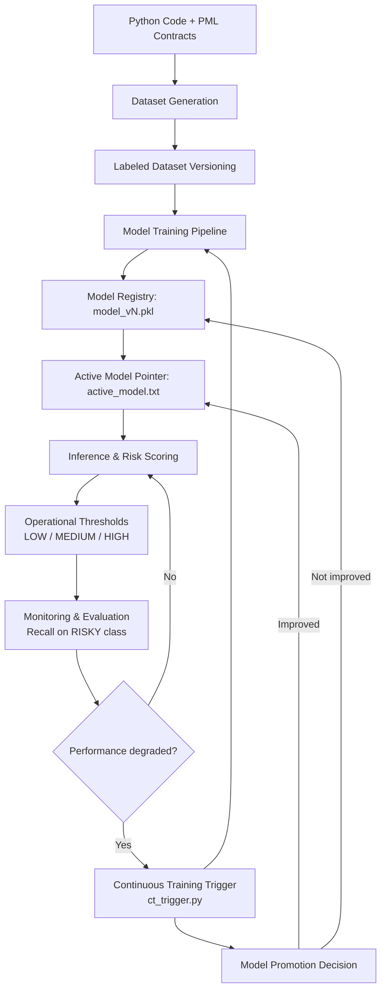

# SpecLens-PML

**SpecLens-PML** is an educational data-driven system that applies
Machine Learning and MLOps principles to the domain of software
correctness.

The project introduces **PML (Python Modelling Language)**, a
lightweight specification language inspired by JML (Java Modelling Language),
and builds an end-to-end **MLOps pipeline with feedback-driven retraining**:

- Ingests Python code annotated with PML contracts  
- Treats code and specifications as structured data  
- Generates labeled datasets through dynamic execution and contract checking  
- Trains and versions machine learning models automatically  
- Serves predictions as operational risk scores (`LOW`, `MEDIUM`, `HIGH`)  
- Monitors safety-oriented metrics (e.g., Recall on risky functions)  
- Triggers Continuous Training when performance degrades  
- Promotes new models only if they improve over the active one  

This closes the loop between **training, monitoring, and deployment**,
implementing a simplified but realistic Continuous Learning workflow.

Unlike formal verification tools, SpecLens-PML does **not** aim to prove
correctness.  
Due to Python's dynamic nature (lack of strong static typing,
runtime-dependent semantics), building an external prover is
impractical.  
SpecLens-PML embraces this reality and provides *probabilistic
guidance*, helping developers identify risky functions before runtime
failures occur.

This repository demonstrates a **complete MLOps lifecycle**: data
generation, training, versioning, inference, monitoring, continuous
retraining and user-facing serving.

------------------------------------------------------------------------

## MLOps Feedback Pipeline

SpecLens-PML implements a simplified but realistic **Continuous Learning**
architecture, inspired by standard MLOps lifecycle.



This feedback closes the loop between **training, monitoring,
retraining and controlled deployment**, reflecting real-world MLOps
practice in safety-oriented systems.

------------------------------------------------------------------------

## Project Structure

```
spec-lens-pml/
├── app.py                  # Streamlit web interface
├── config.yaml             # Centralized system configuration
├── ct_trigger.py           # Continuous Training & promotion engine
├── data/
│   ├── raw/                # Python files annotated with PML
│   └── datasets_v1.csv     # Generated dataset (versioned)
├── pml/
│   └── parser.py           # AST + PML parser
├── pipeline/
│   ├── build_dataset.py    # Data generation and labeling
│   └── train.py            # Model training (version-aware)
├── inference/
│   └── predict.py          # Inference using the active model
├── models/
│   ├── model_vN.pkl        # Versioned model artifacts
│   └── active_model.txt    # Pointer to the active model
├── demo.py                 # End-to-end CLI demo script
├── requirements.txt
└── README.md
```

------------------------------------------------------------------------

## PML Syntax Example

```python
def div(a, b):
    # @requires b != 0
    # @ensures result * b == a
    return a // b
```

```python
class Account:
    # @invariant self.balance >= 0

    def withdraw(self, amount):
        # @requires amount > 0
        # @ensures self.balance >= 0
        self.balance -= amount
```

Supported annotations:

- `@requires <expr>` -- preconditions  
- `@ensures <expr>` -- postconditions  
- `@invariant <expr>` -- class invariants

Expressions are a lightweight subset of Python boolean expressions.

------------------------------------------------------------------------

## Setup

Create and activate a virtual environment:

```bash
python3 -m venv .venv
source .venv/bin/activate
```

Install dependencies:

```bash
pip install -r requirements.txt
```

`requirements.txt`:

```txt
joblib
pandas
PyYAML
scikit-learn
streamlit
```

Initialize the active model (once):

```bash
echo "models/model_v1.pkl" > models/active_model.txt
```

------------------------------------------------------------------------

## End-to-End Demo (CLI)

The entire MLOps pipeline can be executed with a single command:

```bash
python3 demo.py
```

This performs:

1. **Dataset Generation**

   ```bash
   python pipeline/build_dataset.py data/raw data/datasets_v1.csv
   ```

   - Parses Python files with PML
   - Executes functions with generated inputs
   - Evaluates specifications
   - Assigns labels based on observed violations
   - Produces a versioned dataset


2. **Model Training**

   ```bash
   python pipeline/train.py data/datasets_v1.csv
   ```

   - Reads hyperparameters from `config.yaml`
   - Trains a baseline ML classifier
   - Prints evaluation metrics
   - Saves a *new versioned model* (`model_vN.pkl`)


3. **Inference on New Code**

   ```bash
   python inference/predict.py data/raw/example.py
   ```

   - Loads the model pointed by `models/active_model.txt`
   - Parses new code
   - Reconstructs the same feature vector used in training
   - Outputs:
     - a numeric risk score in [0,1]
     - an operational risk level: `LOW`, `MEDIUM`, `HIGH`

The demo automatically runs all three steps on all files in `data/raw/`.

------------------------------------------------------------------------

## Web Interface (Streamlit)

SpecLens-PML also provides a lightweight **web GUI** implemented with
Streamlit. The GUI does not replace the MLOps pipeline: it is a thin
presentation layer on top of the existing backend components.

Start the web application with:

```bash
streamlit run app.py
```

The interface exposes the full system to non-technical users:

- **Run full pipeline**  
  Executes `demo.py` (dataset generation + training + inference).

- **Trigger Continuous Training**  
  Executes `ct_trigger.py`, potentially retraining and promoting a new
  model.

- **Active model display**  
  Shows the model currently in production (from `active_model.txt`).

- **Code analysis**  
  Upload a `.py` file annotated with PML and obtain:
  - Function-level analysis
  - Risk scores
  - Operational levels (`LOW`, `MEDIUM`, `HIGH`)

The Streamlit application reuses the same backend scripts:

- `demo.py`
- `ct_trigger.py`
- `predict.py`

No MLOps logic is duplicated or altered. The GUI only changes *how the
system is operated*, not *how it behaves*.

------------------------------------------------------------------------

## MLOps Lifecycle

SpecLens-PML implements a complete MLOps workflow:

1. **Data Pipeline**
   - Code + specifications are treated as data
   - Datasets are generated and versioned (`datasets_vN.csv`)


2. **ML Kernel**
   - Training is fully reproducible
   - Hyperparameters and thresholds are centralized in `config.yaml`


3. **Model Versioning**
   - Each training run produces a new artifact:
     ```
     models/model_v1.pkl
     models/model_v2.pkl
     ...
     ```
   - Older models are preserved to enable rollback.


4. **Operational Semantics**
   - Predictions are mapped to decision levels:
     - `LOW`    – acceptable risk
     - `MEDIUM` – warning
     - `HIGH`   – critical
   - The system provides *decision support*, not proofs


5. **Continuous Training**

```bash
python3 ct_trigger.py
```

The Continuous Training component:

- Monitors model performance
- Compares metrics with operational thresholds
- Retrains the model when required
- Evaluates the new model against the active one
- Promotes the new model only if it improves safety-oriented metrics

This design enables:

- Reproducibility
- Traceability
- Rollback
- Adaptation to data drift
- Controlled deployment

------------------------------------------------------------------------

## Training vs Serving

SpecLens-PML explicitly separates **model training** from **model
serving**.

- The training pipeline may generate many model versions:
  ```
  models/model_v1.pkl
  models/model_v2.pkl
  models/model_v13.pkl
  ...
  ```

- The inference layer does **not** automatically use the latest trained
  model

Instead, the model currently in production is defined by:

```
models/active_model.txt
```

This file contains the path of the *active* model, for example:

```
models/model_v1.pkl
```

`predict.py` always loads the model specified in `active_model.txt`.
This ensures that:

- Training does not implicitly change system behavior
- New models are never deployed by accident
- Rollback is immediate (just update one file)
- Governance policies can be enforced

### Model Promotion

`ct_trigger.py` closes the loop:

```bash
python3 ct_trigger.py
```

It performs the following steps:

1. Triggers a new training run.
2. Identifies the newly produced model.
3. Evaluates both:
   - The current active model
   - The newly trained model
4. Compares a safety-oriented metric (Recall on the RISKY class).
5. Promotes the new model **only if it improves the metric**.

If the new model is better, `active_model.txt` is automatically updated.
Otherwise, the new model is kept for traceability but not deployed.

This implements a simplified but complete MLOps governance loop with:

- Controlled deployment
- Automatic promotion
- Human-in-the-loop readiness
- Full traceability and rollback

Training and serving are therefore *decoupled by design*, reflecting
real-world MLOps practice in safety-oriented systems.

------------------------------------------------------------------------

## Educational Scope

SpecLens-PML is designed as an educational MLOps system:

- Datasets are generated automatically from code
- Labels come from dynamic execution
- Models are versioned and reproducible
- The entire lifecycle is observable and repeatable

The quality of predictions depends on data availability:
the more annotated code is added to `data/raw/`, the more informative
the system becomes.

The focus of the project is on **architecture, reproducibility, and
lifecycle management**, not on achieving state-of-the-art model
performance.
