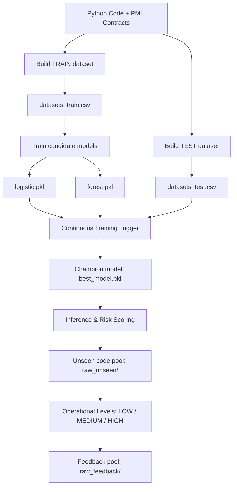

# SpecLens-PML

**SpecLens-PML** is an educational data-driven system that applies
Machine Learning and MLOps principles to the domain of software
correctness.
It was developed as part of the Data-Driven Systems Engineering course (MSc Computer Engineering).

The project introduces **PML (Python Modelling Language)**, a
lightweight specification language inspired by JML (Java Modelling Language),
and builds an end-to-end **MLOps pipeline with feedback-driven retraining**:

- Ingests Python code annotated with PML contracts  
- Treats code and specifications as structured data  
- Generates labeled datasets through dynamic execution and contract checking  
- Trains multiple candidate machine learning models automatically (baseline + challenger)  
- Evaluates candidates on a held-out TEST set (separate from training)  
- Selects and promotes a champion model based on a safety-oriented metric  
- Serves predictions as operational risk scores (`LOW`, `MEDIUM`, `HIGH`)  
- Runs inference on previously unseen code and collects feedback examples  
- Supports a simplified continuous learning loop (train → test → promote → feedback)  

This closes the loop between **training, evaluation, promotion and deployment**,
implementing a simplified but realistic continuous learning workflow.

Unlike formal verification tools, SpecLens-PML does **not** aim to prove
correctness.  
Due to Python's dynamic nature (lack of strong static typing,
runtime-dependent semantics), building an external prover is
impractical.  
SpecLens-PML embraces this reality and provides *probabilistic
guidance*, helping developers identify risky functions before runtime
failures occur.

This repository demonstrates a **complete MLOps lifecycle**: data
generation, training, evaluation, model selection/promotion, inference,
feedback collection and user-facing serving.

------------------------------------------------------------------------

## MLOps Feedback Pipeline

SpecLens-PML implements a simplified but realistic **continuous learning**
architecture, inspired by standard MLOps lifecycle patterns.



This feedback closes the loop between **training, evaluation,
promotion, inference and feedback**, reflecting real-world MLOps practice
in safety-oriented systems.

------------------------------------------------------------------------

## Between Testing and Formal Verification

SpecLens-PML intentionally operates in the space between traditional
software testing and full formal verification:

- Like testing, it relies on **dynamic execution** and observed runtime behavior
- Like specification-based methods, it uses **contracts** (`requires/ensures/invariant`)
  as structured semantic signals

However, unlike theorem provers or static analyzers, SpecLens-PML does not
provide mathematical guarantees of correctness.

Instead, it offers a **probabilistic notion of confidence**:
a data-driven loop that helps highlight potentially risky functions,
and improves by incorporating new examples over time.

In this sense, SpecLens-PML represents an intermediate approach:
more informative than isolated tests, but necessarily weaker than formal proofs.

------------------------------------------------------------------------

## Project Structure

```
spec-lens-pml/
├── app.py                  # Streamlit web interface
├── ct_trigger.py           # Champion/Challenger evaluation + promotion
├── data/
│   ├── raw_train/          # Training pool: annotated Python examples
│   ├── raw_test/           # Test pool: held-out examples for evaluation
│   ├── raw_unseen/         # Unseen pool: used only for inference
│   ├── raw_feedback/       # Feedback pool: collected from high-risk unseen runs
│   ├── _tmp_train/         # Internal staging area (created by demo.py)
│   ├── datasets_train.csv  # Generated training dataset (features + labels)
│   └── datasets_test.csv   # Generated test dataset (features + labels)
├── pml/
│   └── parser.py           # AST + PML parser
├── pipeline/
│   ├── build_dataset.py    # Data generation + dynamic labeling
│   ├── features.py         # Shared feature extraction schema
│   └── train.py            # Candidate model training (logistic / forest)
├── inference/
│   └── predict.py          # Inference using models/best_model.pkl
├── models/
│   ├── logistic.pkl        # Candidate model artifact (baseline)
│   ├── forest.pkl          # Candidate model artifact (challenger)
│   └── best_model.pkl      # Promoted champion model (used for inference)
├── demo.py                 # End-to-end CLI demo (continuous learning)
├── requirements.txt
└── README.md
```

The repository is organized according to a standard MLOps separation of concerns:
data generation, training, evaluation, inference, and deployment artifacts.

Notes:

- `data/_tmp_train/` is a staging folder created by `demo.py` to build the TRAIN dataset.
  It typically contains a copy/merge of `raw_train/` plus any files in `raw_feedback/`.
  You can delete it safely; it is regenerated on each run.
- `data/datasets_v1.csv` (if present from older versions) is a legacy single-split dataset
  and is not used by the current train/test/unseen pipeline.

------------------------------------------------------------------------

## PML Syntax Examples

```python
def div(a, b):
    # @requires b != 0
    # @ensures result * b == a
    return a // b
```

```python
class Account:
    # @invariant self.balance >= 0

    def withdraw(self, amount):
        # @requires amount > 0
        # @ensures self.balance >= 0
        self.balance -= amount
```

Supported annotations:

- `@requires <expr>` -- preconditions  
- `@ensures <expr>` -- postconditions  
- `@invariant <expr>` -- class invariants

Contracts may be placed immediately above a definition or inside the
function body. The parser collects them from both locations.

Expressions are a lightweight subset of Python boolean expressions.

------------------------------------------------------------------------

## Setup

Create and activate a virtual environment:

```bash
python3 -m venv .venv
source .venv/bin/activate
```

Install dependencies:

```bash
pip install -r requirements.txt
```

`requirements.txt` includes the following dependencies:

```txt
joblib
pandas
scikit-learn
sphinx
sphinx-rtd-theme
streamlit
```

Install dependencies (package-style installation option):

```bash
pip install -e .
```

This enables clean imports across the repository (e.g., `import pml`)
without relying on manual `sys.path` modifications.

------------------------------------------------------------------------

## Documentation (Sphinx)

SpecLens-PML can generate developer-oriented API documentation using **Sphinx**,
the standard documentation tool in the Python ecosystem.
Sphinx is already included in the project dependencies (`requirements.txt`).
Unlike Javadoc/JSDoc, Sphinx requires a small configuration step to enable
automatic extraction of documentation from Python modules (via `autodoc`).

To initialize and build the documentation, run:

```bash
# Only required the first time
sphinx-quickstart docs

# Generate API docs automatically from source code
sphinx-apidoc -o docs/source pml pipeline inference
```

Sphinx only documents importable Python packages. To support automatic module
documentation, ensure that `docs/source/conf.py` can import the SpecLens-PML modules:

```python
import os
import sys
sys.path.insert(0, os.path.abspath("../.."))
```

Enable `autodoc` (and related extensions):

```python
extensions = [
    "sphinx.ext.autodoc",
    "sphinx.ext.napoleon",
    "sphinx.ext.viewcode"
]
```

Ensure `docs/source/index.rst` contains `modules` under the `toctree` directive:

```rst
.. toctree::
   :maxdepth: 2
   :caption: Contents:

   modules
```

Build the HTML documentation:

```bash
cd docs
make clean
make html
```

The generated documentation will be available at `docs/build/html/index.html`.

------------------------------------------------------------------------

## End-to-End Demo (CLI)

The entire pipeline (continuous learning demo) can be executed with a single command:

```bash
python3 demo.py
```

This performs:

1. **Build TRAIN dataset (with feedback staging)**

   ```bash
   python pipeline/build_dataset.py data/_tmp_train data/datasets_train.csv
   ```

   - `demo.py` prepares `data/_tmp_train/` by combining:
     - `data/raw_train/` (base training pool)
     - `data/raw_feedback/` (optional feedback pool, if present)
   - `build_dataset.py` then:
     - parses Python files with PML
     - executes functions with generated inputs
     - checks contracts dynamically
     - assigns labels based on observed violations
     - produces `datasets_train.csv`

   Note: labeling uses randomized input generation. Unless you seed the
   random generator, repeated runs may produce slightly different labels and metrics.

2. **Build TEST dataset**

   ```bash
   python pipeline/build_dataset.py data/raw_test data/datasets_test.csv
   ```

   - Produces a held-out dataset used only to compare candidate models
   - This is the reference split for promotion decisions

3. **Train candidate models**

   ```bash
   python pipeline/train.py data/datasets_train.csv --model logistic
   python pipeline/train.py data/datasets_train.csv --model forest
   ```

   - Trains two different model families:
     - Logistic Regression (baseline candidate)
     - Random Forest (challenger candidate)
   - Each candidate is saved under `models/`

4. **Continuous Training Trigger (promotion)**

   ```bash
   python ct_trigger.py data/datasets_test.csv
   ```

   - Loads candidate artifacts (`models/logistic.pkl`, `models/forest.pkl`)
   - Evaluates each candidate on the same held-out TEST dataset (`datasets_test.csv`)
   - Selects the champion by maximizing **Recall on the RISKY class**
   - Promotes the winner as:

     ```
     models/best_model.pkl
     ```

5. **Inference on UNSEEN examples + feedback collection**

   ```bash
   python inference/predict.py data/raw_unseen/example014.py
   ```

   - Loads the promoted champion (`models/best_model.pkl`)
   - Produces:
     - per-function probability of being RISKY
     - operational level: `LOW`, `MEDIUM`, `HIGH`
   - `demo.py` runs inference on all files in `data/raw_unseen/`
   - If a high-risk function is detected, the file is copied into:

     ```
     data/raw_feedback/
     ```

The demo is intentionally small-scale (educational) but follows the logic of
real ML + MLOps systems: train on TRAIN, select on TEST, observe behavior on UNSEEN,
and collect feedback for future training runs.

------------------------------------------------------------------------

## Web Interface (Streamlit)

SpecLens-PML also provides a lightweight **web GUI** (Graphical User Interface) implemented with
Streamlit. The GUI does not replace the pipeline: it is a thin
presentation layer on top of the existing backend components.

Start the web application with:

```bash
streamlit run app.py
```

The interface exposes the system to non-technical users:

1. **Run full pipeline**  
   Executes `demo.py` (train/test build + training + promotion + unseen inference).

2. **Trigger Continuous Training**  
   Executes `ct_trigger.py` to re-evaluate and promote a new champion.

3. **Active model display**  
   Shows the model currently used for inference (`models/best_model.pkl`).

4. **Code analysis**  
   Upload a `.py` file annotated with PML and obtain:
   - Function-level analysis
   - Risk scores
   - Operational levels (`LOW`, `MEDIUM`, `HIGH`)

The Streamlit application reuses the same backend scripts:

- `demo.py`
- `ct_trigger.py`
- `inference/predict.py`

No MLOps logic is duplicated or altered. The GUI only changes *how the
system is operated*, not *how it behaves*.

------------------------------------------------------------------------

## MLOps Lifecycle

SpecLens-PML implements a complete MLOps workflow:

1. **Data Pipeline**
   - Code + specifications are treated as data
   - Datasets are generated from TRAIN and TEST pools:
     - `datasets_train.csv`
     - `datasets_test.csv`

2. **ML Kernel**
   - Training is reproducible when using fixed seeds
   - Feature extraction is centralized in `pipeline/features.py`
   - Inference uses the exact same schema as training (shared feature extractor)

3. **Model Registry (Candidates + Champion)**
   - Each run produces candidate artifacts:
     ```
     models/logistic.pkl
     models/forest.pkl
     ```
   - A single promoted artifact is used for serving:
     ```
     models/best_model.pkl
     ```

4. **Operational Semantics**
   - Predictions are mapped to decision levels:
        - `LOW`    – acceptable risk
        - `MEDIUM` – warning
        - `HIGH`   – critical
   - The system provides *decision support*, not proofs

5. **Continuous Training and Feedback**
   - Promotion is based on a safety-oriented metric:
     **Recall on the RISKY class**
   - New unseen examples can be collected into `raw_feedback/`
   - The feedback pool is automatically folded into training via `demo.py`

This design enables:

- Reproducibility (with fixed seeds)
- Traceability (explicit candidate and champion artifacts)
- Simple governance (promotion based on a single metric)
- A realistic train/test/unseen split
- A minimal feedback loop

------------------------------------------------------------------------

## Training vs Serving

SpecLens-PML explicitly separates **training/evaluation** from **serving**.

- Training produces *candidate* models:
  ```
  models/logistic.pkl
  models/forest.pkl
  ```

- Serving uses a single promoted *champion* model:

  ```
  models/best_model.pkl
  ```

`predict.py` always loads `models/best_model.pkl`.
This ensures that:

- Candidate training does not implicitly change serving behavior
- Deployment is explicit and controlled
- A single artifact defines the model in production

------------------------------------------------------------------------

## Model Promotion

`ct_trigger.py` closes the loop:

```bash
python3 ct_trigger.py data/datasets_test.csv
```

It performs the following steps:

1. Loads candidate models (`logistic`, `forest`)
2. Evaluates both on the same held-out TEST dataset
3. Computes a safety-oriented metric (Recall on RISKY)
4. Promotes the best candidate to `models/best_model.pkl`

This implements a simplified but complete MLOps governance loop with:

- Controlled deployment (only the champion is served)
- Automatic promotion (metric-driven)
- Full separation between TRAIN (fit) and TEST (selection)

------------------------------------------------------------------------

## Educational Scope

SpecLens-PML is designed as an educational MLOps system:

- Datasets are generated automatically from code
- Labels come from dynamic execution and contract checking
- Candidate models are trained and compared on a held-out test set
- The system can collect feedback from unseen examples

The quality of predictions depends on data availability:
the more annotated code is added to `data/raw_train/`, the more informative
the system becomes.

The focus of the project is on **architecture, reproducibility and
lifecycle management**, not on achieving state-of-the-art model
performance.

------------------------------------------------------------------------

## Next Steps and Potential Thesis Extension

SpecLens-PML is intentionally designed as a prototype,
but its architecture naturally opens the door to a broader research
and thesis-level evolution.

Possible next steps include:

- Scaling the dataset with larger real-world annotated Python projects
- Integrating more advanced program analysis features (control-flow, data-flow)
- Extending PML with richer specification constructs
- Adding stronger reproducibility controls (global seeding, deterministic labeling)
- Adopting full MLOps tooling (CI/CD, experiment tracking, drift monitoring)
- Exploring hybrid approaches that combine machine learning with formal methods

With these extensions, SpecLens-PML could serve as a strong foundation
for a thesis focused on **data-driven software correctness**,
continuous verification and modern MLOps governance for safety-oriented systems.
