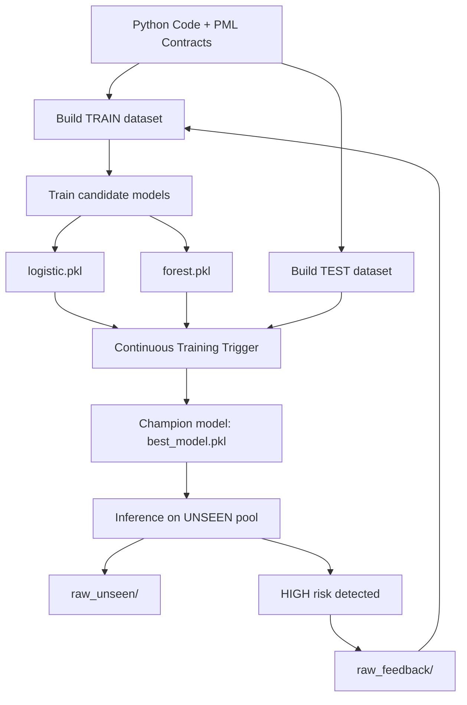

# SpecLens-PML

SpecLens-PML is an educational data-driven system that applies
Machine Learning and MLOps principles to the domain of software
correctness.

The project introduces PML (Python Modelling Language), a
lightweight specification language inspired by JML (Java Modelling Language)
and by Python contract libraries such as `icontract`.
PML supports lightweight contracts, pre-state references through `old(...)`,
and named snapshots through `@snapshot`.

SpecLens-PML builds an end-to-end MLOps pipeline with feedback-driven retraining:

- Ingests Python code annotated with PML contracts
- Treats code and specifications as structured data
- Generates labeled datasets through dynamic execution and contract checking
- Trains multiple candidate machine learning models automatically (baseline + challenger)
- Evaluates candidates on a held-out TEST set, separate from training
- Selects and promotes a champion model based on a safety-oriented metric
- Serves predictions as operational risk scores (`LOW`, `MEDIUM`, `HIGH`)
- Runs inference on previously unseen code and collects feedback examples
- Stores generated dataset artifacts under `data/processed/` to keep raw and derived data clearly separated
- Exports DPG-ready model context for future structural explainability experiments
- Supports a simplified continuous learning loop (`train → test → promote → unseen → feedback → retrain`)

---

## PML Syntax Examples

Contracts may be placed immediately above a definition or inside the
function body:

```python
def div(a, b):
    # @requires b != 0
    # @ensures result * b == a
    return a / b
```

Postconditions may refer to the pre-state of the current call through `old(...)`:

```python
def remove_last(items):
    # @requires len(items) > 0
    # @ensures len(result) == old(len(items)) - 1
    return items[:-1]
```

Named snapshots can be used to capture a pre-state expression once and reuse it
inside postconditions:

```python
def append_value(values, item):
    # @snapshot old_len = len(values)
    # @ensures len(result) == old_len + 1
    # @ensures result[-1] == item
    return values + [item]
```

Class invariants can also be expressed to capture persistent safety conditions:

```python
class Counter:
    # @invariant self.value >= 0

    def __init__(self, start):
        # @requires start >= 0
        self.value = start

    def decrement(self):
        # @requires self.value > 0
        # @ensures self.value >= 0
        self.value -= 1
        return self.value
```

Supported annotations:

- `@requires <expr>`: precondition
- `@ensures <expr>`: postcondition
- `@invariant <expr>`: class invariant
- `old(<expr>)`: lightweight pre-state reference inside postconditions and invariants
- `@snapshot <name> = <expr>`: named pre-state snapshot available to postconditions

The implementation intentionally remains lightweight. It does not aim to support
the full semantics of JML, `icontract`, or Python formal verification tools.

---

## MLOps Feedback Loop

The full pipeline can be executed reproducibly from scratch using the provided
`reset.sh` script, which clears generated artifacts and resets the feedback loop
before a new run.

The following diagram represents the implemented operational lifecycle, including
the feedback loop that reinjects high-risk unseen examples into training on
subsequent runs:


```mermaid
flowchart TD

    A[Python Code + PML Contracts] --> B1[Build TRAIN dataset]
    A --> B2[Build TEST dataset]

    B1 --> D[Train candidate models]
    D --> E1[logistic.pkl]
    D --> E2[forest.pkl]

    E1 --> F[Continuous Training Trigger]
    E2 --> F
    B2 --> F

    F --> G[Champion model: best_model.pkl]

    G --> H[Inference on UNSEEN pool]
    H --> I[raw_unseen/]

    H --> J[HIGH risk detected]
    J --> K[raw_feedback/]

    K --> B1
```

This diagram represents the full implemented workflow: feedback examples are
collected and re-injected into TRAIN at the next run.

---

## Resetting the Demo State

To run the pipeline from scratch, use:

```bash
./reset.sh
python3 demo.py
```

The reset script removes:

- feedback pool
- generated datasets under `data/processed/`
- trained candidate + champion models
- temporary staging artifacts

Raw train / test / unseen pools remain untouched.

---

## Between Testing and Formal Verification

SpecLens-PML intentionally operates in the space between traditional software
testing and full formal verification:

- Like testing, it relies on dynamic execution and observed runtime behavior
- Like specification-based methods, it uses contracts (`requires / ensures / invariant / old(...) / snapshot`)
  as structured semantic signals

However, unlike theorem provers or static analyzers, SpecLens-PML does not
provide mathematical guarantees of correctness.

Instead, it offers a probabilistic notion of confidence: a data-driven loop that
helps highlight potentially risky functions and improves by incorporating new
examples over time. In this sense, SpecLens-PML represents an intermediate
approach: more informative than isolated tests, but necessarily weaker than
formal proofs.

---

## Project Structure

The repository is organized into modular components that reflect the main stages
of the SpecLens-PML MLOps lifecycle, from specification parsing to training,
governance, inference, and deployment:

```text
spec-lens-pml/
├── app.py                  # Streamlit web interface
├── demo.py                 # End-to-end CLI demo (continuous learning)
├── ct_trigger.py           # Champion / Challenger evaluation + promotion
├── reset.sh                # Reset pipeline state for a clean demo run
├── config.yaml             # Central configuration (models + MLOps policies)
├── data/
│   ├── raw_train/          # Training pool: annotated Python examples
│   ├── raw_test/           # Test pool: held-out examples for evaluation
│   ├── raw_unseen/         # Unseen examples analyzed by the promoted champion model
│   ├── raw_feedback/       # Feedback pool: high-risk unseen examples collected for retraining
│   ├── processed/          # Generated datasets (CSV artifacts produced by the pipeline)
│   ├── _tmp_train/         # Temporary staging folder combining raw_train and raw_feedback
│   └── python_by_contract_adaptation_log.md
├── pml/
│   └── parser.py           # AST + PML parser
├── pipeline/
│   ├── build_dataset.py    # Data generation + dynamic labeling
│   ├── features.py         # Shared feature extraction schema
│   └── train.py            # Candidate model training (logistic / forest)
├── inference/
│   └── predict.py          # Inference using the champion model
├── models/
│   ├── logistic.pkl        # Generated candidate model artifact
│   ├── forest.pkl          # Generated candidate model artifact
│   ├── best_model.pkl      # Generated promoted champion model
│   ├── logistic_training_context.pkl
│   └── forest_training_context.pkl
├── requirements.txt
└── README.md
```

Notes:

- Generated datasets are saved under:
  - `data/processed/datasets_train.csv`
  - `data/processed/datasets_test.csv`
- The folder `data/_tmp_train/` is a runtime staging directory rebuilt automatically by `demo.py`
- Model artifacts and processed datasets are generated runtime artifacts and should normally be ignored by Git
- The raw data pools follow a simple numbering convention to make dataset provenance clearer:
  - `raw_train/`: examples such as `example001.py`, `example002.py`, ...
  - `raw_test/`: examples such as `example101.py`, `example102.py`, ...
  - `raw_unseen/`: examples such as `example201.py`, `example202.py`, ...

---

## Dataset Sources and Adapted Examples

The repository includes manually written examples as well as examples adapted
from the Python-by-Contract corpus.

The Python-by-Contract corpus contains Python functions annotated with
`icontract`. These annotations are conceptually similar, in purpose, to
preconditions, postconditions, invariants, and snapshots, but they are not JML.
The examples adapted into SpecLens-PML are normalized into the lightweight
comment-based PML syntax used by this project.

The adaptation process follows these principles:

- Keep examples expressible with lightweight PML contracts
- Prefer simple preconditions, postconditions, invariants, `old(...)`, and `@snapshot`
- Preserve the semantic intent of the original example where possible
- Add both SAFE and intentionally incorrect variants when useful for risk labeling
- Skip or simplify examples that require unsupported semantics, complex object models,
  interprocedural reasoning, or full `icontract` behavior

The file `data/python_by_contract_adaptation_log.md` documents the first batch of
adapted examples and the filtering rationale.

---

## Dataset Schema and DPG-Ready Context

Generated CSV files contain both numeric ML features and lightweight metadata.

Metadata columns include:

- `file`
- `function`
- `label`

Training and evaluation scripts automatically select only the numeric feature
subset for model fitting.

The feature schema includes:

- Structural code features, such as number of parameters, lines of code, branches,
  loops, returns, subscripts, divisions, mutations, and method calls
- Contract-count features, such as number of `requires`, `ensures`, invariants,
  and total contracts
- Contract-complexity features
- Pre-state features, such as `n_old_refs`, `ensures_has_old`, `n_snapshots`,
  `has_snapshot`, `snapshot_complexity`, and `ensures_uses_snapshot`
- State-related indicators such as `has_stateful_contract` and
  `has_prestate_reference`

During training, the pipeline also stores DPG-ready context sidecars for models:

```text
models/logistic_training_context.pkl
models/forest_training_context.pkl
```

These context files include:

- feature names
- training feature matrix
- training labels

The `forest_training_context.pkl` artifact is intended to support future
Decision Predicate Graph (DPG) experiments on tree-based models.

---

## First DPG Experiment

A first Decision Predicate Graph (DPG) experiment is available for the Random
Forest candidate model. DPG is applied to `models/forest.pkl` because DPG
requires a tree-based model; the operational champion promoted by the
Continuous Training Trigger may still be logistic and is not changed by this
experiment.

Run the experiment with:

```bash
python3 experiments/dpg_explain_forest.py
```

Outputs are written to:

```text
experiments/dpg_outputs/
```

The full DPG is saved and analyzed computationally through CSV/text artifacts.
For readable figures, use simplified or class-focused subgraphs, for example:

```bash
python3 experiments/dpg_explain_forest.py --render-simplified-global
```

---

## Setup

Create and activate a virtual environment:

```bash
python3 -m venv .venv
source .venv/bin/activate
```

Install dependencies using package-style installation:

```bash
pip install -e .
```

This installs SpecLens-PML as an editable package and automatically resolves all
dependencies declared in the project configuration (`setup.py` / `pyproject.toml`).
This enables clean imports across the repository, for example `import pml`,
without relying on manual `sys.path` modifications.

---

## Documentation (Sphinx)

SpecLens-PML can generate developer-oriented API documentation using Sphinx, the
standard documentation tool in the Python ecosystem.

Sphinx is included in the project dependencies and can be installed automatically
when setting up the repository with:

```bash
pip install -e .
```

Unlike Javadoc / JSDoc, Sphinx requires a small configuration step to enable
automatic extraction of documentation from Python modules through `autodoc`.
The documentation folder `docs/` is already initialized in this repository.

A lightweight API reference is provided through the file:

- `docs/source/api.rst`

This file documents the core modules of SpecLens-PML, including:

- `pml.parser` for contract extraction
- `pipeline.build_dataset` and `pipeline.train` for the training workflow
- `inference.predict` for serving and risk classification

Sphinx is configured in `docs/source/conf.py`, with the following extensions enabled:

```python
extensions = [
    "sphinx.ext.autodoc",
    "sphinx.ext.napoleon",
    "sphinx.ext.viewcode"
]
```

To build the HTML documentation locally, run:

```bash
cd docs
make clean
make html
```

The generated documentation will be available at:

```text
docs/build/html/index.html
```

---

## End-to-End Demo (CLI)

The entire pipeline can be executed with a single command:

```bash
python3 demo.py
```

This performs the following steps.

### 1. Build TRAIN dataset

The TRAIN dataset is built from the base raw training pool plus feedback examples,
if available. After a clean reset, the feedback directory is empty.

```bash
python pipeline/build_dataset.py data/_tmp_train data/processed/datasets_train.csv
```

`demo.py` prepares a temporary staging folder automatically by combining:

- `data/raw_train/`
- `data/raw_feedback/`

`build_dataset.py` then:

- Parses Python files annotated with PML contracts
- Executes functions with generated inputs
- Checks preconditions, postconditions, invariants, `old(...)`, and supported snapshots dynamically
- Assigns labels based on observed contract violations
- Produces the training dataset:

```text
data/processed/datasets_train.csv
```

Labeling uses randomized input generation. Unless a seed is fixed, repeated runs
may produce slightly different labels and metrics.

### 2. Build TEST dataset

```bash
python pipeline/build_dataset.py data/raw_test data/processed/datasets_test.csv
```

The TEST dataset is a held-out split used only for candidate evaluation. It is
never mixed into training.

### 3. Train candidate models

```bash
python pipeline/train.py data/processed/datasets_train.csv --model logistic
python pipeline/train.py data/processed/datasets_train.csv --model forest
```

This trains two candidate model families:

- Logistic Regression as baseline
- Random Forest as challenger and tree-based model for future DPG analysis

Candidate artifacts are generated under:

```text
models/logistic.pkl
models/forest.pkl
```

The training script also generates DPG-ready context sidecars:

```text
models/logistic_training_context.pkl
models/forest_training_context.pkl
```

### 4. Continuous Training Trigger

```bash
python ct_trigger.py data/processed/datasets_test.csv
```

The trigger:

- Loads candidate artifacts
- Evaluates each candidate on the held-out TEST dataset
- Selects the champion by maximizing recall on the RISKY class:

```text
Recall_RISKY = TP / (TP + FN)
```

Where:

- TP = risky functions correctly identified
- FN = risky functions missed by the model

The governance trigger promotes the candidate model that catches the highest
proportion of real contract violations on the held-out TEST set.

The winner is saved as the serving artifact:

```text
models/best_model.pkl
```

### 5. Inference on UNSEEN examples and feedback collection

```bash
python inference/predict.py data/raw_unseen/example201.py
```

The inference script loads the promoted champion and produces:

- Per-function probability of being RISKY
- Operational risk level:
  - `LOW`
  - `MEDIUM`
  - `HIGH`

`demo.py` runs inference on all files in `data/raw_unseen/`.

By convention, unseen examples use a dedicated numbering range such as:

- `example201.py`
- `example202.py`
- `example203.py`

If a high-risk function is detected, the file is copied into:

```text
data/raw_feedback/
```

Re-running `demo.py` after collecting feedback automatically retrains the system
with an expanded TRAIN pool (`raw_train + raw_feedback`), demonstrating a complete
continuous learning loop:

```text
train → test → promote → unseen → feedback → retrain
```

The demo is intentionally small-scale and educational, but follows the logic of
real ML + MLOps systems: train on TRAIN, select on TEST, observe behavior on
UNSEEN, and collect feedback for future training runs.

---

## Web Interface (Streamlit)

SpecLens-PML also provides a lightweight web GUI (Graphical User Interface)
implemented with Streamlit. The GUI does not replace the pipeline: it is a thin
presentation layer on top of the existing backend components.

Start the web application with:

```bash
streamlit run app.py
```

The interface exposes the system to non-technical users:

1. Run the full pipeline by executing `demo.py`, including TRAIN / TEST dataset
   build, candidate training, champion promotion, unseen inference, feedback
   collection, and retraining on subsequent runs

2. Trigger Continuous Training by executing `ct_trigger.py` to re-evaluate and
   promote a new champion

3. Display the active model currently used for inference (`models/best_model.pkl`)

4. Upload a `.py` file annotated with PML and obtain:

   - Function-level analysis
   - Risk scores
   - Operational levels (`LOW`, `MEDIUM`, `HIGH`)

The Streamlit application reuses the same backend scripts:

- `demo.py`
- `ct_trigger.py`
- `inference/predict.py`

No MLOps logic is duplicated or altered. The GUI only changes how the system is
operated, not how it behaves.

---

## Continuous Integration with Jenkins

SpecLens-PML includes support for Jenkins-based Continuous Integration (CI)
through the provided `Jenkinsfile`.

Although the project is educational, this integration reflects real MLOps
engineering practices: training, evaluation, promotion, and feedback collection
are automated rather than executed manually.

Jenkins is commonly used in industry to:

- Automate reproducible execution of ML workflows
- Enforce governance rules such as champion / challenger promotion
- Track artifacts and ensure traceability
- Integrate training and evaluation into DevOps pipelines

For convenience, the repository also includes a lightweight Docker image that
installs Python inside Jenkins, allowing the full pipeline to run end-to-end
without external agents.

### Running Jenkins locally

Build the Jenkins image:

```bash
docker build -t jenkins-python -f Dockerfile.jenkins .
```

Run Jenkins locally:

```bash
docker run -d -p 8080:8080 -p 50000:50000 --name jenkins-python jenkins-python
```

Open Jenkins:

```text
http://localhost:8080
```

Follow the initial setup wizard and create an admin user.

### Creating the Pipeline Job

1. Click `New Item`
2. Select `Pipeline`
3. Under `Pipeline Definition`, choose:

   ```text
   Pipeline script from SCM
   ```

4. Configure Jenkins by specifying the GitHub repository URL:

   ```text
   https://github.com/CERTprogramming/SpecLens-PML
   ```

5. Jenkins will automatically detect and execute the included `Jenkinsfile`

The provided pipeline automates the full SpecLens-PML continuous learning workflow:

1. Repository checkout
2. Environment setup
3. Optional reset of the demo state through the `RUN_RESET` parameter
4. Execution of the full pipeline with `python3 demo.py`
5. Governance verification, ensuring that `models/best_model.pkl` exists
6. Artifact archiving for traceability

Archived artifacts may include:

- Trained candidate models
- Champion model
- Generated datasets under `data/processed/`

Notes:

- No special plugins are required beyond the standard Jenkins Pipeline setup
- Each build represents a simplified CI loop for specification-driven continuous learning

This integration demonstrates how an ML correctness system can be embedded into
a real CI workflow: dataset generation becomes a CI stage, model training becomes
automated, and promotion becomes a governance decision.

---

## Training, Evaluation, Promotion and Serving

In summary, SpecLens-PML trains multiple candidate models, evaluates them on a
held-out TEST set, and promotes a single champion artifact (`best_model.pkl`) that
is then served for operational inference on new unseen Python programs via
`inference/predict.py` and the Streamlit interface.

The Random Forest candidate is also useful as a tree-based model for future
Decision Predicate Graph analysis, even when the operational champion selected
by the governance metric is a different model.

---

## Educational Scope

SpecLens-PML is designed as an educational MLOps system:

- Datasets are generated automatically from code
- Labels come from dynamic execution and contract checking
- Candidate models are trained and compared on a held-out test set
- The system can collect feedback from unseen examples
- Contract-aware features make the resulting dataset suitable for explanation
  and governance experiments

The quality of predictions depends on data availability: the more annotated code
is added to `data/raw_train/`, the more informative the system becomes.

The focus of the project is on architecture, reproducibility, lifecycle
management, and interpretability-oriented experimentation, not on achieving
state-of-the-art model performance.

---

## Next Steps and Potential Thesis Extension

SpecLens-PML is intentionally designed as a prototype, but its architecture opens
the door to a broader research and thesis-level evolution.

Possible next steps include:

- Integrating Decision Predicate Graphs (DPG) as a structural explainability layer
  for tree-based risk models
- Using DPG to analyze global and local decision predicates behind risk predictions
- Mapping DPG predicates to software-engineering concepts such as missing
  precondition coverage, state-sensitive contracts, contract complexity, mutation,
  indexing risk, or unsafe arithmetic
- Comparing feature-level explanations with structural DPG-based explanations
- Studying controllability and governability by analyzing how DPG structures
  change under different thresholds or policy settings
- Continuing the adaptation of examples from the Python-by-Contract corpus
- Extending PML with additional lightweight constructs only when they are useful
  for risk assessment and remain interpretable
- Exploring further ML architectures beyond logistic regression and random forest
- Adopting fuller MLOps tooling, such as experiment tracking, model lineage, and
  dashboard-based governance

With these extensions, SpecLens-PML could serve as a strong foundation for a
thesis focused on explainable and controllable risk assessment of Python
functions with lightweight contracts.
