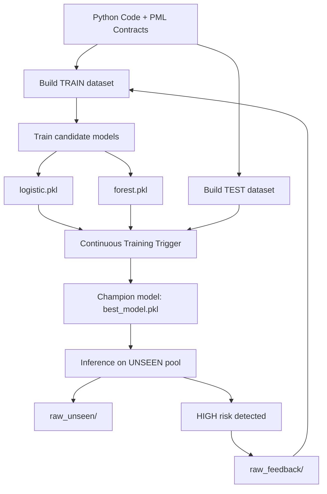

# SpecLens-PML

SpecLens-PML is an educational data-driven system that applies
Machine Learning and MLOps principles to the domain of software
correctness.

The project introduces PML (Python Modelling Language), a
lightweight specification language inspired by JML (Java Modelling Language)
and by Python contract libraries such as `icontract`.
PML supports lightweight contracts, pre-state references through `old(...)`,
and named snapshots through `@snapshot`.

SpecLens-PML builds an end-to-end MLOps pipeline with feedback-driven retraining:

- Ingests Python code annotated with PML contracts
- Treats code and specifications as structured data
- Generates labeled datasets through dynamic execution and contract checking
- Trains multiple candidate machine learning models automatically (baseline + challenger)
- Evaluates candidates on a separate TEST set that is not used to fit candidate models
- Selects and promotes a champion model based on a safety-oriented metric
- Serves predictions as operational risk scores (`LOW`, `MEDIUM`, `HIGH`)
- Runs inference on previously unseen code and collects feedback examples
- Stores generated dataset artifacts under `data/processed/` to keep raw and derived data clearly separated
- Exports DPG-ready model context for structural explainability experiments
- Generates global, local, class-aware, community-level, and concept-level DPG
  explanations for the Random Forest candidate
- Maps DPG predicates to software-engineering concepts for project-oriented interpretation reports
- Applies concept-aware governance policies without modifying the model probability score
- Supports DPG-derived quantitative policy predicates and conservative operational threshold control
- Records append-only governance events and supports explicit human approval or override
- Keeps policy-controlled decisions separate from automatic model-training feedback
- Supports a simplified continuous learning loop (`train → test → promote → unseen → feedback → retrain`)

---

## Quick Start — Simplified SpecLens CLI

The recommended user-facing interface is the repository-level `speclens`
command. It orchestrates the existing pipeline, DPG, control, and governance
modules without duplicating their logic.

The main commands are:

```bash
./speclens reset
./speclens run
./speclens control
./speclens govern
./speclens all
```

Their roles are intentionally simple:

| Command | Purpose |
|---|---|
| `./speclens reset` | Remove generated runtime state while preserving versioned source data and policies |
| `./speclens run` | Clean end-to-end MLOps run: reset, dataset generation, training, promotion, unseen inference, feedback |
| `./speclens run --continue` | Run another learning cycle while keeping previously collected feedback/runtime state |
| `./speclens control` | Generate DPG explanations, concept summaries, control evaluation, and open the simplified global graph |
| `./speclens graph` | Reopen the latest generated DPG graph |
| `./speclens govern` | Run governed inference on a concrete example and highlight cases requiring human review |
| `./speclens all` | Run the complete demo: clean pipeline, explainability/control analysis, governance example, and graph visualization |

A typical interactive demo is therefore:

```bash
./speclens run
./speclens control
./speclens govern
```

or, for a single-command end-to-end presentation:

```bash
./speclens all
```

The lower-level Python scripts documented later in this README remain the
implementation and developer interfaces used by `speclens`, CI, tests, and
research experiments.

---

## PML Syntax Examples

Contracts may be placed immediately above a definition or inside the
function body:

```python
def div(a, b):
    # @requires b != 0
    # @ensures result * b == a
    return a / b
```

Postconditions may refer to the pre-state of the current call through `old(...)`:

```python
def remove_last(items):
    # @requires len(items) > 0
    # @ensures len(result) == old(len(items)) - 1
    return items[:-1]
```

Named snapshots can be used to capture a pre-state expression once and reuse it
inside postconditions:

```python
def append_value(values, item):
    # @snapshot old_len = len(values)
    # @ensures len(result) == old_len + 1
    # @ensures result[-1] == item
    return values + [item]
```

Class invariants can also be expressed to capture persistent safety conditions:

```python
class Counter:
    # @invariant self.value >= 0

    def __init__(self, start):
        # @requires start >= 0
        self.value = start

    def decrement(self):
        # @requires self.value > 0
        # @ensures self.value >= 0
        self.value -= 1
        return self.value
```

Supported annotations:

- `@requires <expr>`: precondition
- `@ensures <expr>`: postcondition
- `@invariant <expr>`: class invariant
- `old(<expr>)`: lightweight pre-state reference inside postconditions and invariants
- `@snapshot <name> = <expr>`: named pre-state snapshot available to postconditions

The implementation intentionally remains lightweight. It does not aim to support
the full semantics of JML, `icontract`, or Python formal verification tools.

---

## MLOps Feedback Loop

The full pipeline can be executed reproducibly through the simplified CLI.
`./speclens run` performs a clean reset before starting the end-to-end workflow,
while `./speclens run --continue` keeps collected feedback for the next learning
cycle.

The following diagram represents the implemented operational lifecycle, including
the feedback loop that reinjects high-risk unseen examples into training on
subsequent runs:


```mermaid
flowchart TD

    A[Python Code + PML Contracts] --> B1[Build TRAIN dataset]
    A --> B2[Build TEST dataset]

    B1 --> D[Train candidate models]
    D --> E1[logistic.pkl]
    D --> E2[forest.pkl]

    E1 --> F[Continuous Training Trigger]
    E2 --> F
    B2 --> F

    F --> G[Champion model: best_model.pkl]

    G --> H[Inference on UNSEEN pool]
    H --> I[raw_unseen/]

    H --> J[HIGH risk detected]
    J --> K[raw_feedback/]

    K --> B1
```

This diagram focuses on the continuous-learning feedback path: examples with an
original HIGH model risk level are collected and re-injected into TRAIN at the
next run. Concept-aware control and human review are described separately below.

---

## Resetting the Demo State

The recommended reset command is:

```bash
./speclens reset
```

To immediately start a fresh end-to-end run, use:

```bash
./speclens run
```

`./speclens run` invokes the reset automatically before executing the pipeline.

The reset removes:

- feedback pool
- generated datasets under `data/processed/`
- trained candidate + champion models
- temporary staging artifacts
- generated DPG outputs under `experiments/dpg_outputs/`
- runtime governance audit events under `data/governance/`
- generated control-layer evaluation outputs under `experiments/control_outputs/`

Raw train / test / unseen pools, source code, and versioned governance policies
remain untouched.

The lower-level `reset.sh` script remains available as the backend implementation
used by the simplified CLI and automation.

---

## Between Testing and Formal Verification

SpecLens-PML intentionally operates in the space between traditional software
testing and full formal verification:

- Like testing, it relies on dynamic execution and observed runtime behavior
- Like specification-based methods, it uses contracts (`requires / ensures / invariant / old(...) / snapshot`)
  as structured semantic signals

However, unlike theorem provers or static analyzers, SpecLens-PML does not
provide mathematical guarantees of correctness.

Instead, it offers a probabilistic notion of confidence: a data-driven loop that
helps highlight potentially risky functions and improves by incorporating new
examples over time. In this sense, SpecLens-PML represents an intermediate
approach: more informative than isolated tests, but necessarily weaker than
formal proofs.

---

## Project Structure

The repository is organized into modular components that reflect the main stages
of the SpecLens-PML MLOps lifecycle, from specification parsing to training,
governance, inference, and deployment:

```text
spec-lens-pml/
├── speclens                # Recommended user-facing CLI
├── app.py                  # Streamlit web interface
├── demo.py                 # Backend end-to-end MLOps orchestration
├── ct_trigger.py           # Champion / Challenger evaluation + promotion
├── reset.sh                # Backend runtime reset used by the simplified CLI
├── config.yaml             # Central model and operational-threshold configuration
├── data/
│   ├── raw_train/          # Training pool: annotated Python examples
│   ├── raw_test/           # Test pool: separate from model fitting
│   ├── raw_unseen/         # Unseen examples analyzed by the promoted champion model
│   ├── raw_feedback/       # Feedback pool: high-risk unseen examples collected for retraining
│   ├── processed/          # Generated datasets (CSV artifacts produced by the pipeline)
│   ├── _tmp_train/         # Temporary staging folder combining raw_train and raw_feedback
│   └── python_by_contract_adaptation_log.md
├── pml/
│   └── parser.py           # AST + PML parser
├── pipeline/
│   ├── build_dataset.py    # Data generation + dynamic labeling
│   ├── features.py         # Shared feature extraction schema
│   └── train.py            # Candidate model training (logistic / forest)
├── inference/
│   └── predict.py          # Champion inference + concept-aware operational control
├── governance/
│   ├── concepts.py         # Shared feature -> software-engineering concept taxonomy
│   ├── control.py          # Policy matching, conservative threshold control, audit events
│   ├── policies.yaml       # Versioned human-defined governance policies
│   └── review.py           # Append-only human approval / override
├── experiments/
│   ├── dpg_explain_forest.py   # DPG extraction, metrics, plots, and class-aware analyses
│   ├── dpg_concept_analysis.py # Concept-level analysis of DPG communities and local paths
│   ├── evaluate_control.py      # Baseline vs concept-aware control evaluation
│   ├── dpg_outputs/             # Generated DPG artifacts (ignored by Git)
│   └── control_outputs/         # Generated control-evaluation artifacts (ignored by Git)
├── tests/
│   └── test_governance.py      # Control/governance regression tests
├── models/
│   ├── logistic.pkl        # Generated candidate model artifact
│   ├── forest.pkl          # Generated candidate model artifact
│   ├── best_model.pkl      # Generated promoted champion model
│   ├── logistic_training_context.pkl
│   └── forest_training_context.pkl
├── SpecLens_Governance.md  # Detailed control/governance architecture and evaluation notes
├── pyproject.toml          # Package metadata and dependencies
└── README.md
```

Notes:

- Generated datasets are saved under:
  - `data/processed/datasets_train.csv`
  - `data/processed/datasets_test.csv`
- The folder `data/_tmp_train/` is a runtime staging directory rebuilt automatically by `demo.py`
- Model artifacts and processed datasets are generated runtime artifacts and should normally be ignored by Git
- Generated DPG artifacts are written under `experiments/dpg_outputs/` and are ignored by Git
- Generated control-evaluation artifacts are written under `experiments/control_outputs/` and are ignored by Git
- Runtime governance events are written under `data/governance/*.jsonl` and are ignored by Git
- Versioned policy definitions remain under `governance/policies.yaml`
- The raw data pools follow a simple numbering convention to make dataset provenance clearer:
  - `raw_train/`: examples such as `example001.py`, `example002.py`, ...
  - `raw_test/`: examples such as `example101.py`, `example102.py`, ...
  - `raw_unseen/`: examples such as `example201.py`, `example202.py`, ...

---

## Dataset Sources and Adapted Examples

The repository includes manually written examples as well as examples adapted
from the Python-by-Contract corpus.

The Python-by-Contract corpus contains Python functions annotated with
`icontract`. These annotations are conceptually similar, in purpose, to
preconditions, postconditions, invariants, and snapshots, but they are not JML.
The examples adapted into SpecLens-PML are normalized into the lightweight
comment-based PML syntax used by this project.

The adaptation process follows these principles:

- Keep examples expressible with lightweight PML contracts
- Prefer simple preconditions, postconditions, invariants, `old(...)`, and `@snapshot`
- Preserve the semantic intent of the original example where possible
- Add both SAFE and intentionally incorrect variants when useful for risk labeling
- Skip or simplify examples that require unsupported semantics, complex object models,
  interprocedural reasoning, or full `icontract` behavior

The file `data/python_by_contract_adaptation_log.md` documents the first batch of
adapted examples and the filtering rationale.

---

## Dataset Schema and DPG-Ready Context

Generated CSV files contain both numeric ML features and lightweight metadata.

Metadata columns include:

- `file`
- `function`
- `label`

Training and evaluation scripts automatically select only the numeric feature
subset for model fitting.

The feature schema includes:

- Structural code features, such as number of parameters, lines of code, branches,
  loops, returns, subscripts, divisions, mutations, and method calls
- Contract-count features, such as number of `requires`, `ensures`, invariants,
  and total contracts
- Contract-complexity features
- Pre-state features, such as `n_old_refs`, `ensures_has_old`, `n_snapshots`,
  `has_snapshot`, `snapshot_complexity`, and `ensures_uses_snapshot`
- State-related indicators such as `has_stateful_contract` and
  `has_prestate_reference`

During training, the pipeline also stores DPG-ready context sidecars for models:

```text
models/logistic_training_context.pkl
models/forest_training_context.pkl
```

These context files include:

- feature names
- training feature matrix
- training labels

The `forest_training_context.pkl` artifact supports
Decision Predicate Graph (DPG) experiments on tree-based models.

---

## DPG Structural Explainability

SpecLens-PML includes an experimental Decision Predicate Graph (DPG) layer for
the Random Forest candidate model. DPG is applied to `models/forest.pkl` because
it requires a tree-based model. The operational champion promoted by the
Continuous Training Trigger may still be Logistic Regression, and the DPG
experiment does not modify the champion-selection or governance logic.

The experiment uses:

```text
models/forest.pkl
models/forest_training_context.pkl
```

The training context contains the feature names, training feature matrix, and
training labels required to reconstruct and analyze the model's decision
structure.

### DPG prerequisites

The DPG repository is expected as a sibling directory of SpecLens-PML:

```text
Dev/
├── spec-lens-pml/
└── DPG/
```

With the SpecLens-PML virtual environment active, install DPG in editable mode:

```bash
python3 -m pip install -e ../DPG
```

Graphviz is required only for DOT-to-PNG/SVG rendering. Check its availability
with:

```bash
dot -V
```

### Generate the complete DPG artifacts

Run the complete extraction and analysis with:

```bash
python3 experiments/dpg_explain_forest.py
```

This generates the complete graph data, node and edge metrics, community
information, class boundaries, top predicates, and local explanation paths.

The complete DPG can also be rendered explicitly:

```bash
python3 experiments/dpg_explain_forest.py --render
```

For large graphs, rendering may be skipped by the script's size guard or limited
with a rendering timeout. The complete graph remains available through the CSV
and text artifacts even when an image is not generated.

### Generate a simplified global graph

The complete DPG can be too dense for direct visual inspection. A simplified,
class-aware global view can be generated with:

```bash
python3 experiments/dpg_explain_forest.py \
  --render-simplified-global \
  --top-k-nodes 15 \
  --node-metric local_reaching \
  --max-edges 25
```

The simplified visualization:

- selects the most central decision predicates;
- always includes the `Class SAFE` and `Class RISKY` leaves;
- preserves weighted connections between selected predicates and class leaves;
- adds bridge predicates when needed to keep class leaves connected;
- generates DOT, PNG, and SVG files.

The node-ranking metric can be selected from:

```text
betweenness
degree
local_reaching
```

For example, the same graph can be generated using betweenness centrality:

```bash
python3 experiments/dpg_explain_forest.py \
  --render-simplified-global \
  --top-k-nodes 15 \
  --node-metric betweenness \
  --max-edges 25
```

### Generate the class-aware community analysis

Run the community-level analysis with:

```bash
python3 experiments/dpg_explain_forest.py \
  --render-community-summary
```

For each DPG community, the experiment reports:

- the community identifier;
- the number of predicate nodes;
- representative predicates;
- aggregate connection weight toward `Class SAFE`;
- aggregate connection weight toward `Class RISKY`;
- normalized SAFE and RISKY association scores;
- a dominant classification of `SAFE`, `RISKY`, `MIXED`, or `UNCONNECTED`.

The class association is based on the weighted outgoing connections from
predicates in each community to the class leaves. It is a structural association,
not a causal claim about individual predicates.

The margin used to identify mixed communities can be configured. For example:

```bash
python3 experiments/dpg_explain_forest.py \
  --render-community-summary \
  --community-mixed-margin 0.10
```

The community summary plot labels communities using readable names such as:

```text
Community 1 — RISKY-dominant
Community 2 — SAFE-dominant
```

It also shows normalized class-association percentages together with the
corresponding aggregate edge weights.

### Generate the concept-level community analysis

After generating the DPG community artifacts, run the concept-level analysis:

```bash
python3 experiments/dpg_concept_analysis.py
```

This script maps DPG predicates to software-engineering concept families such as
contract coverage, precondition complexity, postcondition complexity, pre-state
reasoning, snapshot usage, indexing behavior, state mutation, interface
complexity, and control-flow complexity.

The analysis is computed from the complete DPG community and local-path artifacts,
not from the simplified visualization. The simplified graph is only a readability
view, while the concept-level analysis uses the full predicate set available in
the DPG outputs.

The mapping is deterministic and intentionally conservative. The shared
feature-to-concept taxonomy is defined in `governance/concepts.py` and is reused
by both DPG analysis and the operational control layer:

```text
DPG predicate → feature → concept family → polarity → interpretation
```

For example:

```text
has_subscript > 0.5 → INDEX_ACCESS → present
n_requires <= 0.5  → PRECONDITION_COVERAGE → none_or_low
has_snapshot > 0.5 → SNAPSHOT_USAGE → present
```

The generated interpretation is descriptive. It highlights structural
associations learned by the model and should be checked against local SAFE and
RISKY paths before drawing conclusions about concrete decision behavior.

### Run the experimental DPG analysis pipeline

For normal use, the recommended command is:

```bash
./speclens control
```

It generates the DPG, community and concept summaries, evaluates the control
layer, prints a concise interpretation, and opens the simplified global graph.

For advanced/developer use, the same experimental analysis can be run directly
with:

```bash
python3 experiments/dpg_explain_forest.py \
  --render-simplified-global \
  --top-k-nodes 15 \
  --node-metric local_reaching \
  --max-edges 25 \
  --render-community-summary

python3 experiments/dpg_concept_analysis.py
```

This produces the complete DPG metrics, simplified visualizations, class-aware
community analysis, concept-level summaries, and a compact project-oriented
community interpretation report.

### Run a full clean demo and DPG analysis

The recommended user-facing sequence is:

```bash
./speclens run
./speclens control
./speclens govern
```

or, equivalently, the complete presentation workflow can be executed with:

```bash
./speclens all
```

The sequence is:

```text
reset
→ demo pipeline
→ DPG structural analysis
→ concept-level interpretation
→ concept-aware control evaluation
→ governed inference
→ graph visualization
```

`./speclens control` automatically opens the simplified global DPG when the
desktop environment supports it. The graph can later be reopened with:

```bash
./speclens graph
```

The lower-level scripts remain available for reproducibility, debugging, CI, and
research experiments:

```bash
./reset.sh
python3 demo.py

python3 experiments/dpg_explain_forest.py \
  --render-simplified-global \
  --top-k-nodes 15 \
  --node-metric local_reaching \
  --max-edges 25 \
  --render-community-summary

python3 experiments/dpg_concept_analysis.py
python3 experiments/evaluate_control.py
```

Runtime feedback files under `data/raw_feedback/` should not be committed,
except for an optional `.gitkeep` file used to preserve the empty directory.

### Generate both simplified visualizations

The simplified global graph and the class-aware community summary can also be
generated without the concept-level step:

```bash
python3 experiments/dpg_explain_forest.py \
  --render-simplified-global \
  --top-k-nodes 15 \
  --node-metric local_reaching \
  --max-edges 25 \
  --render-community-summary
```

### Generated DPG outputs

All generated artifacts are written to:

```text
experiments/dpg_outputs/
```

Main complete-analysis outputs include:

```text
global_summary.txt
dpg_nodes.csv
dpg_node_metrics.csv
dpg_edge_metrics.csv
dpg_communities.csv
dpg_class_boundaries.json
top_predicates.txt
local_safe_paths.csv
local_safe_summary.json
local_risky_paths.csv
local_risky_summary.json
```

Simplified global visualization outputs include:

```text
simplified_global_dpg.dot
simplified_global_dpg.png
simplified_global_dpg.svg
simplified_global_nodes.csv
simplified_global_edges.csv
```

Class-aware community outputs include:

```text
community_class_summary.csv
community_class_summary.txt
community_predicates.csv
simplified_community_dpg.dot
simplified_community_dpg.png
simplified_community_dpg.svg
```

Concept-level community outputs include:

```text
community_concept_predicates.csv
community_concept_summary.csv
community_concept_summary.txt
community_interpretation_summary.txt
concept_taxonomy.csv
local_path_concept_predicates.csv
local_path_concept_summary.csv
local_path_concept_summary.txt
```

Generated DPG outputs are runtime artifacts and are excluded from version
control.


---


## Concept-Aware Control and Governance

SpecLens-PML separates the model prediction from the operational decision and
from subsequent human governance actions.

The serving path is:

```text
model probability score
        ↓
original operational risk level
        ↓
software-engineering concepts
        ↓
human-defined policy matching
        ↓
controlled HIGH threshold
        ↓
controlled risk level
        ↓
audit event
        ↓
optional human APPROVE / OVERRIDE
```

The central invariant is:

> Governance policies never modify the trained model or its probability score.

The default operational thresholds are:

```text
LOW     score < 0.20
MEDIUM  0.20 <= score < 0.60
HIGH    score >= 0.60
```

A policy may only make the HIGH threshold more conservative. A policy whose
configured HIGH threshold is greater than the baseline HIGH threshold is
rejected.

### Shared software-engineering concept taxonomy

The deterministic feature-to-concept mapping is defined in:

```text
governance/concepts.py
```

The same taxonomy is used by:

- `experiments/dpg_concept_analysis.py`, for explanation;
- `inference/predict.py`, for operational concept extraction;
- `governance/control.py`, for policy interpretation and validation.

Representative mappings include:

```text
has_subscript        -> INDEX_ACCESS
n_requires           -> PRECONDITION_COVERAGE
n_contracts_total    -> CONTRACT_COVERAGE
ensures_complexity   -> POSTCONDITION_COMPLEXITY
n_loc                -> STRUCTURAL_SIZE
has_snapshot         -> SNAPSHOT_USAGE
```

This shared layer keeps DPG explanation and operational control aligned.

### Policy language

Policies are versioned in:

```text
governance/policies.yaml
```

The control layer supports simple concept-state conditions:

```yaml
when:
  INDEX_ACCESS: present
  MISSING_PRECONDITION_COVERAGE: present
```

and quantitative predicates that preserve DPG threshold evidence:

```yaml
when:
  - concept: CONTRACT_COVERAGE
    feature: n_contracts_total
    operator: "<="
    value: 2.5

  - concept: POSTCONDITION_COMPLEXITY
    feature: ensures_complexity
    operator: ">"
    value: 9.5
```

The current policy configuration is version 2 and includes:

- **P001** — indexed access without precondition coverage;
- **P002** — limited contract coverage with complex postconditions;
- **P003** — larger functions with complex postconditions.

P001 validates the concept-state policy mechanism. P002 and P003 were informed
by DPG evidence and selected on the internal TRAIN-derived validation split.
They are human-defined governance rules informed by explanation; they should not
be interpreted as automatically learned causal rules.

### Control-layer evaluation

The recommended command is:

```bash
./speclens control
```

This runs DPG generation, concept analysis, control evaluation, concise result
summaries, and graph visualization in one step.

For advanced/developer use, the control evaluation can still be invoked directly:

```bash
python3 experiments/evaluate_control.py
```

The experiment compares the baseline operational decision with the controlled
decision without changing champion/challenger model selection.

Generated outputs include:

```text
experiments/control_outputs/control_predictions.csv
experiments/control_outputs/changed_decisions.csv
experiments/control_outputs/policy_summary.csv
experiments/control_outputs/control_summary.txt
```

A current 30-case TRAIN-derived validation split produced:

| Metric | Baseline HIGH=0.60 | Concept-aware control |
|---|---:|---:|
| RISKY recall | 0.273 | 0.545 |
| RISKY precision | 0.500 | 0.667 |
| RISKY F1 | 0.353 | 0.600 |
| False negatives | 8 | 5 |
| False positives | 3 | 3 |

Three validation decisions changed from MEDIUM to HIGH, all for RISKY-labelled
cases.

On the current 25-case TEST split:

| Metric | Baseline HIGH=0.60 | Concept-aware control |
|---|---:|---:|
| Accuracy | 0.840 | 0.920 |
| RISKY recall | 0.500 | 0.750 |
| RISKY precision | 1.000 | 1.000 |
| RISKY F1 | 0.667 | 0.857 |
| False negatives | 4 | 2 |
| False positives | 0 | 0 |

The two TEST decisions changed by policy version 2 were:

```text
keys_count
    score: 0.555
    MEDIUM -> HIGH
    policy: P002

update_value
    score: 0.589
    MEDIUM -> HIGH
    policies: P002 + P003
```

The model scores remained unchanged.

A diagnostic global reduction of the HIGH threshold from `0.60` to `0.50`
produced the same final HIGH/not-HIGH decisions and the same predictive metrics
as the current policy-controlled configuration on both the validation and TEST
splits.

Therefore, these experiments do **not** demonstrate predictive superiority over
global threshold tuning. The demonstrated role of the policy layer is instead
to provide intervention that is:

- conditional rather than globally applied;
- grounded in explicit software-engineering concepts;
- supported by inspectable feature/predicate evidence;
- versioned;
- auditable;
- subject to human approval or override.

Because the current TEST split was inspected during policy development, these
numbers should be treated as engineering/prototype evidence rather than an
untouched final benchmark. Publication-grade evaluation should freeze the policy
configuration before using a fresh holdout or an appropriate repeated evaluation
protocol.

### Audit trail and human review

Matched policies can generate append-only control events under:

```text
data/governance/control_events.jsonl
```

A matched policy may be audited even when it does not change the operational
risk level. Human review is required only when a matched policy changes the
decision and that policy has `require_review: true`.

A controlled decision can be approved through the simplified CLI:

```bash
./speclens govern \
  --approve EVENT_ID \
  --reason "Policy evidence reviewed."
```

or overridden:

```bash
./speclens govern \
  --override EVENT_ID MEDIUM \
  --reason "Manual review accepts the original MEDIUM level."
```

The lower-level `governance/review.py` command remains available for direct
developer use.

Human review is append-only: the original control event is preserved and a
separate `human_review` record is added. Overrides require an explicit rationale.

### Feedback isolation

The continuous-learning feedback loop is intentionally based on the **original
model risk level**, not on the policy-controlled level.

Only an inference output containing:

```text
Original risk level: HIGH
```

is eligible for automatic feedback collection.

A function escalated from MEDIUM to HIGH by a governance policy therefore does
not silently become a future training example. This keeps model learning
separate from human-defined operational governance.

For the full architecture, policy semantics, evaluation notes, limitations, and
review workflow, see [`SpecLens_Governance.md`](SpecLens_Governance.md).

---

## Setup

Create and activate a virtual environment:

```bash
python3 -m venv .venv
source .venv/bin/activate
```

Install dependencies using package-style installation:

```bash
pip install -e .
```

This installs SpecLens-PML as an editable package and automatically resolves all
dependencies declared in the project configuration (`pyproject.toml`).
This enables clean imports across the repository, for example `import pml`,
without relying on manual `sys.path` modifications.

---

## Documentation (Sphinx)

SpecLens-PML can generate developer-oriented API documentation using Sphinx, the
standard documentation tool in the Python ecosystem.

Sphinx is included in the project dependencies and can be installed automatically
when setting up the repository with:

```bash
pip install -e .
```

Unlike Javadoc / JSDoc, Sphinx requires a small configuration step to enable
automatic extraction of documentation from Python modules through `autodoc`.
The documentation folder `docs/` is already initialized in this repository.

A lightweight API reference is provided through the file:

- `docs/source/api.rst`

This file documents the core modules of SpecLens-PML, including:

- `pml.parser` for contract extraction
- `pipeline.build_dataset` and `pipeline.train` for the training workflow
- `inference.predict` for serving and risk classification

Sphinx is configured in `docs/source/conf.py`, with the following extensions enabled:

```python
extensions = [
    "sphinx.ext.autodoc",
    "sphinx.ext.napoleon",
    "sphinx.ext.viewcode"
]
```

To build the HTML documentation locally, run:

```bash
cd docs
make clean
make html
```

The generated documentation will be available at:

```text
docs/build/html/index.html
```

---

## End-to-End Demo (CLI)

The recommended user-facing command is:

```bash
./speclens run
```

This performs a clean reset and then executes the end-to-end MLOps pipeline.

To keep previously collected feedback for another learning cycle, use:

```bash
./speclens run --continue
```

The underlying orchestration is still implemented by `demo.py`; the detailed
backend steps are documented below.

### 1. Build TRAIN dataset

The TRAIN dataset is built from the base raw training pool plus feedback examples,
if available. After a clean reset, the feedback directory is empty.

```bash
python pipeline/build_dataset.py data/_tmp_train data/processed/datasets_train.csv
```

`demo.py` prepares a temporary staging folder automatically by combining:

- `data/raw_train/`
- `data/raw_feedback/`

`build_dataset.py` then:

- Parses Python files annotated with PML contracts
- Executes functions with generated inputs
- Checks preconditions, postconditions, invariants, `old(...)`, and supported snapshots dynamically
- Assigns labels based on observed contract violations
- Produces the training dataset:

```text
data/processed/datasets_train.csv
```

Labeling uses randomized input generation. Unless a seed is fixed, repeated runs
may produce slightly different labels and metrics.

### 2. Build TEST dataset

```bash
python pipeline/build_dataset.py data/raw_test data/processed/datasets_test.csv
```

The TEST dataset is separate from model fitting and is never mixed into
training. It is used for candidate evaluation and promotion. In the current
research prototype it has also been inspected during control-layer development,
so it should not be treated as an untouched final benchmark.

### 3. Train candidate models

```bash
python pipeline/train.py data/processed/datasets_train.csv --model logistic
python pipeline/train.py data/processed/datasets_train.csv --model forest
```

This trains two candidate model families:

- Logistic Regression as baseline
- Random Forest as challenger and tree-based model for DPG analysis

Candidate artifacts are generated under:

```text
models/logistic.pkl
models/forest.pkl
```

The training script also generates DPG-ready context sidecars:

```text
models/logistic_training_context.pkl
models/forest_training_context.pkl
```

### 4. Continuous Training Trigger

```bash
python ct_trigger.py data/processed/datasets_test.csv
```

The trigger:

- Loads candidate artifacts
- Evaluates each candidate on the separate TEST dataset
- Selects the champion by maximizing recall on the RISKY class:

```text
Recall_RISKY = TP / (TP + FN)
```

Where:

- TP = risky functions correctly identified
- FN = risky functions missed by the model

The governance trigger promotes the candidate model that catches the highest
proportion of real contract violations on the separate TEST set.

The winner is saved as the serving artifact:

```text
models/best_model.pkl
```

### 5. Inference on UNSEEN examples and feedback collection

For normal governed inference and a concise human-readable summary, use:

```bash
./speclens govern
```

By default this analyzes `data/raw_test/example102.py`, which is useful for
demonstrating policy matches, changed decisions, and human-review requirements.

For direct inference on a specific file, use:

```bash
./speclens govern data/raw_unseen/example201.py
```

The lower-level backend command remains:

```bash
python inference/predict.py data/raw_unseen/example201.py
```

The inference script loads the promoted champion and produces, for each
function:

- the unchanged model probability of being RISKY;
- the original operational risk level (`LOW`, `MEDIUM`, `HIGH`);
- relevant software-engineering concept states;
- matched governance policies and predicate evidence;
- the original and controlled HIGH thresholds;
- the controlled operational risk level;
- whether the decision changed;
- whether human review is required;
- the governance event identifier when a policy matched.

`demo.py` runs inference on all files in `data/raw_unseen/`.

By convention, unseen examples use a dedicated numbering range such as:

- `example201.py`
- `example202.py`
- `example203.py`

If the **original model risk level** is HIGH, the file is copied into:

```text
data/raw_feedback/
```

A policy-controlled escalation from MEDIUM to HIGH does not by itself enter the
feedback pool. This prevents governance policies from silently influencing
future model training.

Re-running `demo.py` after collecting feedback automatically retrains the system
with an expanded TRAIN pool (`raw_train + raw_feedback`), demonstrating a complete
continuous learning loop:

```text
train → test → promote → unseen → feedback → retrain
```

The demo is intentionally small-scale and educational, but follows the logic of
real ML + MLOps systems: train on TRAIN, select on TEST, observe behavior on
UNSEEN, and collect feedback for future training runs.

---

## Web Interface (Streamlit)

SpecLens-PML also provides a lightweight web GUI (Graphical User Interface)
implemented with Streamlit. The GUI does not replace the pipeline: it is a thin
presentation layer on top of the existing backend components.

Start the web application with:

```bash
streamlit run app.py
```

The interface exposes the system to non-technical users:

1. Run the full pipeline by executing `demo.py`, including TRAIN / TEST dataset
   build, candidate training, champion promotion, unseen inference, feedback
   collection, and retraining on subsequent runs

2. Trigger Continuous Training by executing `ct_trigger.py` to re-evaluate and
   promote a new champion

3. Display the active model currently used for inference (`models/best_model.pkl`)

4. Upload a `.py` file annotated with PML and obtain:

   - Function-level analysis
   - Risk scores
   - Operational levels (`LOW`, `MEDIUM`, `HIGH`)

The Streamlit application reuses the same backend scripts:

- `demo.py`
- `ct_trigger.py`
- `inference/predict.py`

No MLOps logic is duplicated or altered. The GUI only changes how the system is
operated, not how it behaves.

---

## Continuous Integration with Jenkins

SpecLens-PML includes support for Jenkins-based Continuous Integration (CI)
through the provided `Jenkinsfile`.

Although the project is educational, this integration reflects real MLOps
engineering practices: training, evaluation, promotion, and feedback collection
are automated rather than executed manually.

Jenkins is commonly used in industry to:

- Automate reproducible execution of ML workflows
- Enforce governance rules such as champion / challenger promotion
- Track artifacts and ensure traceability
- Integrate training and evaluation into DevOps pipelines

For convenience, the repository also includes a lightweight Docker image that
installs Python inside Jenkins, allowing the full pipeline to run end-to-end
without external agents.

### Running Jenkins locally

Build the Jenkins image:

```bash
docker build -t jenkins-python -f Dockerfile.jenkins .
```

Run Jenkins locally:

```bash
docker run -d -p 8080:8080 -p 50000:50000 --name jenkins-python jenkins-python
```

Open Jenkins:

```text
http://localhost:8080
```

Follow the initial setup wizard and create an admin user.

### Creating the Pipeline Job

1. Click `New Item`
2. Select `Pipeline`
3. Under `Pipeline Definition`, choose:

   ```text
   Pipeline script from SCM
   ```

4. Configure Jenkins by specifying the GitHub repository URL:

   ```text
   https://github.com/CERTprogramming/SpecLens-PML
   ```

5. Jenkins will automatically detect and execute the included `Jenkinsfile`

The provided pipeline automates the full SpecLens-PML continuous learning workflow:

1. Repository checkout
2. Environment setup
3. Optional reset of the demo state through the `RUN_RESET` parameter
4. Execution of the full pipeline with `python3 demo.py`
5. Governance verification, ensuring that `models/best_model.pkl` exists
6. Artifact archiving for traceability

Archived artifacts may include:

- Trained candidate models
- Champion model
- Generated datasets under `data/processed/`

Notes:

- No special plugins are required beyond the standard Jenkins Pipeline setup
- Each build represents a simplified CI loop for specification-driven continuous learning

This integration demonstrates how an ML correctness system can be embedded into
a real CI workflow: dataset generation becomes a CI stage, model training becomes
automated, and promotion becomes a governance decision.

---

## Training, Evaluation, Promotion and Serving

In summary, SpecLens-PML trains multiple candidate models, evaluates them on a
separate TEST set, and promotes a single champion artifact (`best_model.pkl`) that
is then served for operational inference on new unseen Python programs. The
recommended CLI entry point is `./speclens`, while `inference/predict.py` and the
Streamlit interface remain direct/backend interfaces.

Serving preserves the model probability and original risk level before applying
the optional concept-aware control layer. Governance policies can only make the
HIGH threshold more conservative and can create auditable review events; they do
not modify candidate/champion selection.

The Random Forest candidate is also used as the tree-based model for
Decision Predicate Graph analysis, even when the operational champion selected
by the promotion metric is a different model.

---

## Educational Scope

SpecLens-PML is designed as an educational MLOps system:

- Datasets are generated automatically from code
- Labels come from dynamic execution and contract checking
- Candidate models are trained and compared on a TEST set separate from model fitting
- The system can collect feedback from unseen examples
- Contract-aware features make the resulting dataset suitable for explanation
  and governance experiments
- DPG predicates can be mapped to software-engineering concepts
- Human-defined policies can control operational decisions without changing model scores
- Policy matches, approvals, and overrides can be recorded in an append-only audit trail

The quality of predictions depends on data availability: the more annotated code
is added to `data/raw_train/`, the more informative the system becomes.

The focus of the project is on architecture, reproducibility, lifecycle
management, and interpretability-oriented experimentation, not on achieving
state-of-the-art model performance.

---

## Next Steps and Research Extensions

SpecLens-PML is intentionally designed as a prototype, but its architecture opens
the door to broader research-oriented extensions.

Possible next steps include:

- Evaluating frozen governance policies on a fresh, untouched holdout or through
  repeated evaluation protocols
- Scaling the dataset with additional contract and program-structure diversity
- Extending the DPG analysis with additional stability and scalability studies
- Comparing feature-level explanations with DPG structural explanations and
  concept-level summaries
- Studying when concept-aware policy control differs materially from global
  threshold tuning
- Evaluating policy robustness under retraining and model changes
- Continuing the adaptation of examples from the Python-by-Contract corpus
- Extending PML with additional lightweight constructs only when they are useful
  for risk assessment and remain interpretable
- Exploring further ML architectures beyond logistic regression and random forest
- Adopting fuller MLOps tooling, such as experiment tracking, model lineage, and
  dashboard-based governance

With these extensions, SpecLens-PML could serve as a strong foundation for
explainable and controllable risk assessment of Python functions with
lightweight contracts.
