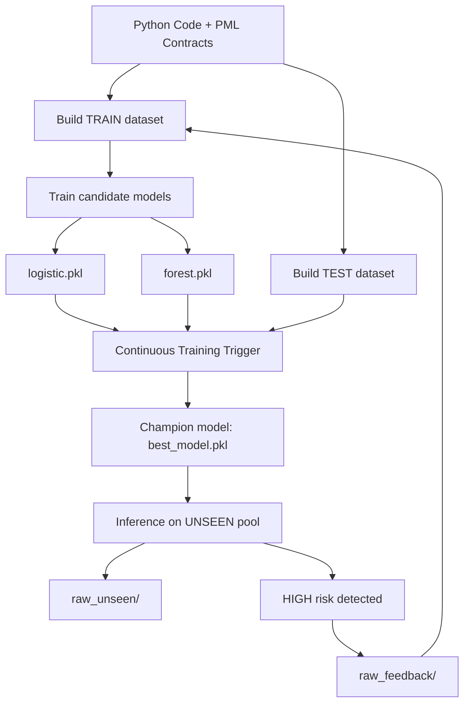

# SpecLens-PML

SpecLens-PML is an educational data-driven system that applies
Machine Learning and MLOps principles to the domain of software
correctness.
The project introduces PML (Python Modelling Language), a
lightweight specification language inspired by JML (Java Modelling Language),
and builds an end-to-end MLOps pipeline with feedback-driven retraining:

- Ingests Python code annotated with PML contracts  
- Treats code and specifications as structured data  
- Generates labeled datasets through dynamic execution and contract checking  
- Trains multiple candidate machine learning models automatically (baseline + challenger)  
- Evaluates candidates on a held-out TEST set (separate from training)  
- Selects and promotes a champion model based on a safety-oriented metric  
- Serves predictions as operational risk scores (`LOW`, `MEDIUM`, `HIGH`)  
- Runs inference on previously unseen code and collects feedback examples  
- Supports a simplified continuous learning loop (`train → test → promote → unseen → feedback → retrain`).

---

## PML Syntax Examples

Contracts may be placed immediately above a definition or inside the
function body:

```python
def div(a, b):
    # @requires b != 0
    # @ensures result * b == a
    return a / b
```

Class invariants can also be expressed to capture persistent safety conditions:

```python
class Counter:
    # @invariant self.value >= 0
    def __init__(self, start):
        self.value = start

    def decrement(self):
        # @requires self.value > 0
        self.value -= 1
```

Supported annotations:

- `@requires <expr>` -- preconditions  
- `@ensures <expr>` -- postconditions  
- `@invariant <expr>` -- class invariants

---

## MLOps Feedback Loop

The full pipeline can be executed reproducibly from scratch using the provided `reset.sh` script, 
which clears generated artifacts and resets the feedback loop before a new run. 
The following diagram represents the implemented operational lifecycle, 
including the feedback loop that reinjects high-risk unseen examples into training on subsequent runs:



This diagram represents the full implemented workflow: feedback examples are collected and re-injected into TRAIN at the next run.

---

## Resetting the Demo State

To run the pipeline from scratch, use:

```bash
./reset.sh
python3 demo.py
```

The reset script removes:
- feedback pool
- generated datasets
- trained candidate + champion models

Raw train / test / unseen pools remain untouched.

---

## Between Testing and Formal Verification

SpecLens-PML intentionally operates in the space between traditional
software testing and full formal verification:

- Like testing, it relies on dynamic execution and observed runtime behavior
- Like specification-based methods, it uses contracts (`requires / ensures / invariant`)
  as structured semantic signals

However, unlike theorem provers or static analyzers, SpecLens-PML does not
provide mathematical guarantees of correctness.
Instead, it offers a "probabilistic notion of confidence":
a data-driven loop that helps highlight potentially risky functions
and improves by incorporating new examples over time.
In this sense, SpecLens-PML represents an intermediate approach:
more informative than isolated tests, but necessarily weaker than formal proofs.

---

## Project Structure

The repository is organized into modular components that reflect the main stages 
of the SpecLens-PML MLOps lifecycle, from specification parsing to training, 
governance, inference and deployment:

```
spec-lens-pml/
├── app.py                  # Streamlit web interface
├── demo.py                 # End-to-end CLI demo (continuous learning)
├── ct_trigger.py           # Champion / Challenger evaluation + promotion
├── reset.sh                # Reset pipeline state for a clean demo run
├── config.yaml             # Central configuration (models + MLOps policies)
├── data/
│   ├── raw_train/          # Training pool: annotated Python examples
│   ├── raw_test/           # Test pool: held-out examples for evaluation
│   ├── raw_unseen/         # New code to analyze: user-provided Python files evaluated by the champion model
│   └── raw_feedback/       # Feedback pool: collected from high-risk unseen runs
├── pml/
│   └── parser.py           # AST + PML parser
├── pipeline/
│   ├── build_dataset.py    # Data generation + dynamic labeling
│   ├── features.py         # Shared feature extraction schema
│   └── train.py            # Candidate model training (logistic / forest)
├── inference/
│   └── predict.py          # Inference using the champion model
├── models/
│   ├── logistic.pkl        # Candidate model artifact (baseline)
│   ├── forest.pkl          # Candidate model artifact (challenger)
│   └── best_model.pkl      # Promoted champion model (used for inference)
├── requirements.txt
└── README.md
```

Notes:

- Generated datasets (`datasets_train.csv`, `datasets_test.csv`) are created automatically
  when running `demo.py` and are not part of the tracked repository state
- Temporary staging folders are internal runtime artifacts and are not documented here

---

## Setup

Create and activate a virtual environment:

```bash
python3 -m venv .venv
source .venv/bin/activate
```

Install dependencies (package-style installation):

```bash
pip install -e .
```

This installs SpecLens-PML as an editable package and automatically resolves all dependencies 
declared in the project configuration (`setup.py` / `pyproject.toml`).
This enables clean imports across the repository (e.g., `import pml`)
without relying on manual `sys.path` modifications.

---

## Documentation (Sphinx)

SpecLens-PML can generate developer-oriented API documentation using **Sphinx**,
the standard documentation tool in the Python ecosystem.
Sphinx is already included in the project dependencies (`requirements.txt`).
Unlike Javadoc/JSDoc, Sphinx requires a small configuration step to enable
automatic extraction of documentation from Python modules (via `autodoc`).

To initialize and build the documentation, run:

```bash
# Only required the first time
sphinx-quickstart docs

# Generate API docs automatically from source code
sphinx-apidoc -o docs/source pml pipeline inference
```

Sphinx only documents importable Python packages. To support automatic module
documentation, ensure that `docs/source/conf.py` can import the SpecLens-PML modules:

```python
import os
import sys
sys.path.insert(0, os.path.abspath("../.."))
```

Enable `autodoc` (and related extensions):

```python
extensions = [
    "sphinx.ext.autodoc",
    "sphinx.ext.napoleon",
    "sphinx.ext.viewcode"
]
```

Ensure `docs/source/index.rst` contains `modules` under the `toctree` directive:

```rst
.. toctree::
   :maxdepth: 2
   :caption: Contents:

   modules
```

Build the HTML documentation:

```bash
cd docs
make clean
make html
```

The generated documentation will be available at `docs/build/html/index.html`.

---

## End-to-End Demo (CLI)

The entire pipeline (continuous learning demo) can be executed with a single command:

```bash
python3 demo.py
```

This performs:

1. Build TRAIN dataset (base raw training pool plus feedback examples, if available, but the feedback directory is empty after a clean reset):

   ```bash
   python pipeline/build_dataset.py data/_tmp_train data/datasets_train.csv
   ```

   - `demo.py` prepares a temporary staging folder automatically by combining:
     - `data/raw_train/` (base training pool)
     - `data/raw_feedback/` (optional feedback pool collected from previous runs)

   - `build_dataset.py` then:
     - Parses Python files annotated with PML contracts
     - Executes functions with generated inputs
     - Checks pre/postconditions dynamically
     - Assigns labels based on observed contract violations
     - Produces the training dataset:

     ```
     data/datasets_train.csv
     ```

   Note: labeling uses randomized input generation. Unless you fix a seed,
   repeated runs may produce slightly different labels and metrics.


2. Build TEST dataset:

   ```bash
   python pipeline/build_dataset.py data/raw_test data/datasets_test.csv
   ```

   - Produces a held-out dataset used only for candidate evaluation
   - This split is never mixed into training


3. Train candidate models:

   ```bash
   python pipeline/train.py data/datasets_train.csv --model logistic
   python pipeline/train.py data/datasets_train.csv --model forest
   ```

   - Trains two candidate model families:
     - Logistic Regression (baseline)
     - Random Forest (challenger)

   - Candidate artifacts are saved under:

     ```
     models/logistic.pkl
     models/forest.pkl
     ```

4. Continuous Training Trigger (promotion):

   ```bash
   python ct_trigger.py data/datasets_test.csv
   ```

   - Loads candidate artifacts
   - Evaluates each candidate on the held-out TEST dataset
   - Selects the champion by maximizing recall on the RISKY class, promoting the candidate model that detects the highest proportion of truly RISKY cases on the held-out TEST set.
   - Promotes the winner as the single serving artifact:

     ```
     models/best_model.pkl
     ```

5. Inference on UNSEEN examples + feedback collection:

   ```bash
   python inference/predict.py data/raw_unseen/example014.py
   ```

   - Loads the promoted champion (`models/best_model.pkl`)
   - Produces:
     - Per-function probability of being RISKY
     - Operational level:
        - `LOW` (acceptable risk)
        - `MEDIUM` (warning)
        - `HIGH` (critical)


   - `demo.py` runs inference on all files in `data/raw_unseen/`
   - If a high-risk function is detected, the file is copied into:

     ```
     data/raw_feedback/
     ```

Re-running `demo.py` after collecting feedback automatically retrains the system
with an expanded TRAIN pool (raw_train + raw_feedback), demonstrating a complete
continuous learning loop:

`train → test → promote → unseen → feedback → retrain`

The demo is intentionally small-scale (educational) but follows the logic of
real ML + MLOps systems: train on TRAIN, select on TEST, observe behavior on UNSEEN
and collect feedback for future training runs.

---

## Web Interface (Streamlit)

SpecLens-PML also provides a lightweight web GUI (Graphical User Interface) implemented with
Streamlit. The GUI does not replace the pipeline: it is a thin
presentation layer on top of the existing backend components.

Start the web application with:

```bash
streamlit run app.py
```

The interface exposes the system to non-technical users:

1. Run the full pipeline executing `demo.py`, including TRAIN / TEST dataset build, candidate training, champion promotion, unseen inference, feedback collection and retraining on subsequent runs.

2. Trigger Continuous Training executing `ct_trigger.py` to re-evaluate and promote a new champion 

3. Active model display showing the model currently used for inference (`models/best_model.pkl`) 

4. Code analysis uploading a `.py` file annotated with PML and obtain: 

   - Function-level analysis
   - Risk scores
   - Operational levels (`LOW`, `MEDIUM`, `HIGH`)

The Streamlit application reuses the same backend scripts:

- `demo.py`
- `ct_trigger.py`
- `inference/predict.py`

No MLOps logic is duplicated or altered. The GUI only changes *how the
system is operated*, not *how it behaves*.

---

## Continuous Integration with Jenkins

SpecLens-PML includes support for Jenkins-based Continuous Integration (CI) through the provided `Jenkinsfile`.
Although the project is educational, this integration reflects real MLOps engineering practices: training,
evaluation, promotion and feedback collection are automated rather than executed manually.

Jenkins is commonly used in industry to:

- Automate reproducible execution of ML workflows  
- Enforce governance rules (champion / challenger promotion)  
- Track artifacts and ensure traceability  
- Integrate training and evaluation into DevOps pipelines  

For convenience, the repository also includes a lightweight Docker image that installs Python inside Jenkins,
allowing the full pipeline to run end-to-end without external agents:

1. Build the Jenkins image:

   ```bash
   docker build -t jenkins-python -f Dockerfile.jenkins .
   ```

2. Run Jenkins locally:

   ```bash
   docker run -d -p 8080:8080 -p 50000:50000 --name jenkins-python jenkins-python
   ```

3. Open Jenkins:

   ```
   http://localhost:8080
   ```
   Follow the initial setup wizard and create an admin user.

Creating the Pipeline Job:

1. Click `New Item`

2. Select `Pipeline`

3. Under `Pipeline Definition` choose:

   ```
   Pipeline script from SCM
   ```

4. Configure Jenkins by specifying the GitHub repository URL:

   ```
   https://github.com/CERTprogramming/SpecLens-PML

5. Jenkins will automatically detect and execute the included `Jenkinsfile`

The provided pipeline automates the full SpecLens-PML continuous learning workflow:

1. Repository checkout (pulls the latest version of the project from GitHub) 

2. Environment setup (creates a clean Python virtual environment and installs dependencies) 

3. Optional reset demo state, the job exposes a boolean parameter:  

   - `RUN_RESET`

   If enabled, Jenkins runs:

   ```bash
   ./reset.sh
   ```

   This removes feedback examples, generated datasets and trained models,
   ensuring a fully reproducible clean run.
   If disabled (default), the feedback pool is preserved, allowing the model
   to improve incrementally across executions.


4. Run the full pipeline:

   ```bash
   python3 demo.py
   ```

   This triggers:

   - TRAIN dataset generation (raw_train + feedback)
   - TEST dataset generation (held-out)
   - Candidate training (logistic + forest)
   - Champion promotion via `ct_trigger.py`
   - Inference on unseen examples + feedback collection


5. Governance verification, Jenkins ensures that a promoted champion artifact exists:

   ```
   models/best_model.pkl
   ```

6. Artifact archiving, key artifacts are archived for traceability:  

   - Trained candidate models  
   - Champion model  
   - Generated datasets  

Notes:

- No special plugins are required beyond the standard Jenkins Pipeline setup
- Each build represents a simplified CI loop for specification-driven continuous learning

This integration demonstrates how an ML correctness system can be embedded into a real CI workflow:
dataset generation becomes a CI stage, model training becomes automated and promotion becomes a governance decision

---

## Training, Evaluation, Promotion and Serving

In summary, SpecLens-PML trains multiple candidate models, evaluates them on a held-out TEST set
and promotes a single champion artifact (`best_model.pkl`) that is then served for operational
inference on new unseen Python programs (via `inference/predict.py` and the Streamlit interface).

---

## Educational Scope

SpecLens-PML is designed as an educational MLOps system:

- Datasets are generated automatically from code
- Labels come from dynamic execution and contract checking
- Candidate models are trained and compared on a held-out test set
- The system can collect feedback from unseen examples

The quality of predictions depends on data availability:
the more annotated code is added to `data/raw_train/`, the more informative
the system becomes.
The focus of the project is on architecture, reproducibility and
lifecycle management, not on achieving state-of-the-art model
performance.

---

## Next Steps and Potential Thesis Extension

SpecLens-PML is intentionally designed as a prototype,
but its architecture naturally opens the door to a broader research
and thesis-level evolution.

Possible next steps include:

- Extending PML with richer specification constructs
- Exploring further ML architectures beyond logistic regression and random forest, expanding the candidate model pool with more advanced classifiers
- Adopting full MLOps tooling (CI / CD, experiment tracking, drift monitoring),
  for example through platforms such as Neptune.ai or MLflow to enable richer metric dashboards,
  lineage tracking, and collaborative governance
- Extending the pipeline toward automated program assistance: future work could include automatic contract inference for Python functions,
  combined with genetic programming techniques to generate and evaluate alternative implementations of high-risk code.
  This would allow SpecLens-PML not only to detect risk, but also to suggest candidate variants that may exhibit lower predicted risk

With these extensions, SpecLens-PML could serve as a strong foundation
for a thesis focused on data-driven software correctness,
continuous verification and modern MLOps governance for safety-oriented systems.

