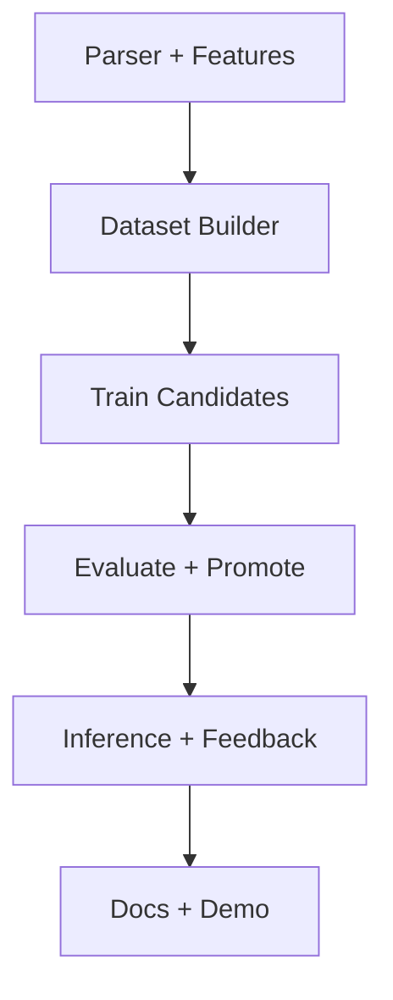

# SpecLens — Project Proposal & Development Plan

## 1. Project Summary

SpecLens-PML is an educational end-to-end MLOps system developed for the
Data-Driven Systems Engineering course (MSc Computer Engineering).

It treats **code + specifications as structured data** and implements:

- dynamic labeling via contract checking  
- candidate training (baseline + challenger)  
- champion promotion based on Recall(RISKY)  
- inference on unseen examples  
- feedback-driven retraining loop  

---

## 2. Deliverables (Implemented)

- PML parser (`pml/parser.py`)
- Dataset generation (`pipeline/build_dataset.py`)
- Shared feature schema (`pipeline/features.py`)
- Candidate training (`pipeline/train.py`)
- Continuous Training Trigger (`ct_trigger.py`)
- Inference service (`inference/predict.py`)
- Streamlit GUI (`app.py`)
- Documentation (SSD, Governance, Development Plan)

---

## 3. Milestones

- M1 Dataset pipeline operational  
- M2 Baseline + challenger training implemented  
- M3 Held-out TEST evaluation implemented  
- M4 Champion promotion implemented  
- M5 Inference + operational risk levels  
- M6 Feedback loop integrated  
- M7 Final demo + documentation  

---

## 4. Work Breakdown Structure (WBS)

| Area | Task | Output |
|------|------|--------|
| Parsing | PML contract extraction | Parsed units |
| Data Pipeline | Dynamic dataset generation | TRAIN/TEST CSVs |
| ML Kernel | Candidate model training | logistic.pkl / forest.pkl |
| Governance | Promotion trigger | best_model.pkl |
| Inference | Risk scoring + levels | LOW/MEDIUM/HIGH |
| Feedback | Collect high-risk unseen | raw_feedback/ |
| Deployment | Streamlit interface | app.py |
| Documentation | Final technical docs | Submission package |

---

## 5. Iterative Sprint Organization

- Sprint 1: Parser + feature extraction  
- Sprint 2: Dataset builder + labeling  
- Sprint 3: Candidate training  
- Sprint 4: Evaluation + promotion  
- Sprint 5: Inference + feedback  
- Sprint 6: Documentation + demo polishing  

---

## 6. Definition of Ready / Done

### Definition of Ready (DoR)
- Raw pools available (`raw_train/`, `raw_test/`, `raw_unseen/`)
- Configuration present (`config.yaml`)
- Dependencies installed (`requirements.txt`)

### Definition of Done (DoD)
- End-to-end run works via `demo.py`
- Champion promotion produces `models/best_model.pkl`
- Inference outputs risk levels
- Feedback loop populates `raw_feedback/`
- Documents aligned with README terminology
