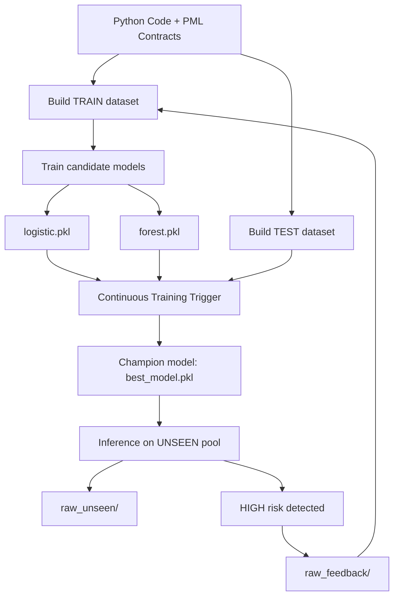

# SpecLens — Project Proposal and Development Plan

## 1. Project Summary

SpecLens-PML is an educational data-driven system that applies
Machine Learning and MLOps principles to the domain of software
correctness.
The project introduces PML (Python Modelling Language), a
lightweight specification language inspired by JML (Java Modelling Language),
and builds an end-to-end MLOps pipeline with feedback-driven retraining:

- Ingests Python code annotated with PML contracts  
- Treats code and specifications as structured data  
- Generates labeled datasets through dynamic execution and contract checking  
- Trains multiple candidate machine learning models automatically (baseline + challenger)  
- Evaluates candidates on a held-out TEST set (separate from training)  
- Selects and promotes a champion model based on a safety-oriented metric  
- Serves predictions as operational risk scores (`LOW`, `MEDIUM`, `HIGH`)  
- Runs inference on previously unseen code and collects feedback examples  
- Supports a simplified continuous learning loop (`train → test → promote → unseen → feedback → retrain`).

---

## 2. PML Syntax Examples

Contracts may be placed immediately above a definition or inside the
function body:

```python
def div(a, b):
    # @requires b != 0
    # @ensures result * b == a
    return a / b
```

Class invariants can also be expressed to capture persistent safety conditions:

```python
class Counter:
    # @invariant self.value >= 0
    def __init__(self, start):
        self.value = start

    def decrement(self):
        # @requires self.value > 0
        self.value -= 1
```

Supported annotations:

- `@requires <expr>` -- preconditions  
- `@ensures <expr>` -- postconditions  
- `@invariant <expr>` -- class invariants

---


## 3. Project Deliverables

The implemented deliverables include:

- PML parser (`pml/parser.py`)
- Dataset generation pipeline (`pipeline/build_dataset.py`)
- Shared feature extraction schema (`pipeline/features.py`)
- Candidate model training (`pipeline/train.py`)
- Continuous Training Trigger (`ct_trigger.py`)
- Central governance configuration (`config.yaml`)
- Inference module (`inference/predict.py`)
- Containerized CI pipeline with Jenkins (replicable execution environment)
- Streamlit web interface (`app.py`)
- Reproducibility and reset script (`reset.sh`)
- Full documentation package (`Project Proposal and Development Plan`, `Operational Governance and Versioning Document`, `System Specification Document (SSD)`), 
  with Sphinx-ready API documentation support

---

## 4. Development Milestones

The following milestones summarize the main implementation stages of SpecLens-PML, from dataset preparation to continuous learning deployment and final documentation delivery:

- **M1** Dataset pipeline operational  
- **M2** Baseline and challenger candidate models trained
- **M3** Held-out TEST dataset (evaluation set not used during training)
- **M4** Champion promotion mechanism 
- **M5** Inference module producing operational risk levels: `LOW, MEDIUM, HIGH`
- **M6** Feedback loop integrated into training  
- **M7** Final demo and documentation delivery  

---

## 5. Work Breakdown Structure (WBS)

The Work Breakdown Structure below decomposes the project into its main engineering areas, highlighting the corresponding tasks and produced artifacts:

| Area | Task | Output |
|------|------|--------|
| Parsing | PML contract extraction | Parsed specification units |
| Data Pipeline | Dynamic dataset generation | `TRAIN / TEST` CSV datasets |
| ML Kernel | Candidate model training | `logistic.pkl`, `forest.pkl` |
| Governance | Promotion trigger | `best_model.pkl` champion |
| Configuration | Continuous training policy rules | `config.yaml` |
| Inference | Risk scoring and classification | `LOW / MEDIUM / HIGH` levels |
| Feedback | High-risk unseen collection | `raw_feedback/` pool |
| CI | Containerized pipeline automation | Jenkins execution environment |
| Deployment | Streamlit application | `app.py` interface |
| Documentation | Technical reports | Submission package |

---

## 6. Operational Workflow Diagram (MLOps Lifecycle)

The full pipeline can be executed reproducibly from scratch using the provided `reset.sh` script, which clears generated artifacts and resets the feedback loop before a new run.
The following diagram represents the implemented operational lifecycle, including the feedback loop that reinjects high-risk unseen examples into training on subsequent runs:



This diagram represents the full implemented workflow: feedback examples are collected and re-injected into TRAIN at the next run.

---

## 7. Iterative Sprint Plan

Development followed an iterative sprint-based organization:

| Sprint | Focus | Deliverable |
|--------|-------|------------|
| S1 | Parser + Features | Specification extraction |
| S2 | Dataset Builder | `TRAIN / TEST` dataset creation |
| S3 | Candidate Training | Baseline + challenger models |
| S4 | Governance Trigger | Champion promotion artifact |
| S5 | Inference + Feedback | Risk levels + feedback pool |
| S6 | CI + Documentation | Jenkins automation + final submission |

---

## 8. Definition of Ready (DoR)

A sprint is ready to start when:

- Raw pools are available (`raw_train/`, `raw_test/`, `raw_unseen/`)
- System configuration is present (`config.yaml`)
- Dependencies are installed
- The repository state is clean (optionally reset via `reset.sh`)

---

## 9. Definition of Done (DoD)

A sprint is considered complete when:

- The pipeline is executed end-to-end via `demo.py` 
- A promoted champion model is produced (`models/best_model.pkl`)
- Inference generates operational risk levels (`LOW / MEDIUM / HIGH`)
- Feedback examples are correctly collected in `raw_feedback/`
- Deliverables are reproducible and documented

