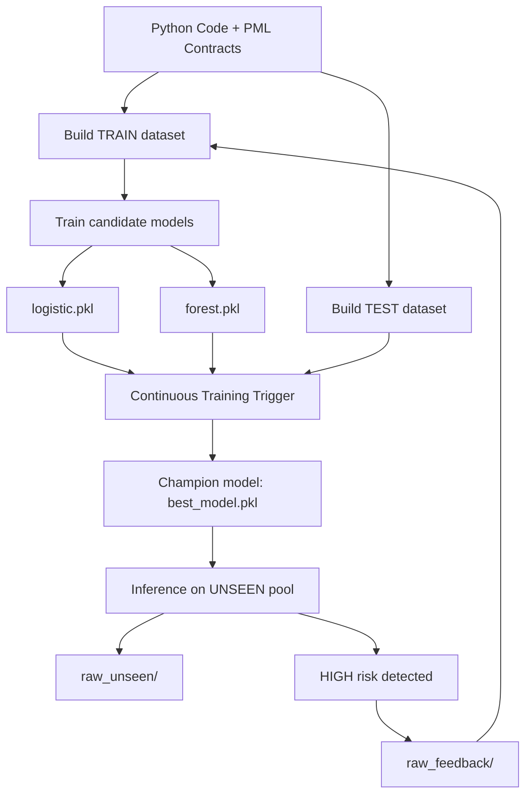

# SpecLens — Project Proposal & Development Plan

## 1. Project Summary

SpecLens-PML is an educational end-to-end MLOps system developed for the
Data-Driven Systems Engineering course (MSc Computer Engineering).

The project treats **Python code and formal specifications as structured data**, enabling a continuous learning workflow based on:

- dynamic labeling through contract checking  
- candidate training (baseline + challenger models)  
- champion promotion using Recall on the *RISKY* class  
- inference on unseen examples  
- feedback-driven retraining loop  

---

## 2. Project Deliverables

The implemented deliverables include:

- PML parser (`pml/parser.py`)
- Dataset generation pipeline (`pipeline/build_dataset.py`)
- Shared feature extraction schema (`pipeline/features.py`)
- Candidate model training (`pipeline/train.py`)
- Continuous Training Trigger (`ct_trigger.py`)
- Inference module (`inference/predict.py`)
- Streamlit web interface (`app.py`)
- Full documentation package (SSD, Governance, Development Plan)

---

## 3. Development Milestones

- **M1** Dataset pipeline operational  
- **M2** Baseline and challenger models implemented  
- **M3** Held-out TEST evaluation completed  
- **M4** Champion promotion mechanism implemented  
- **M5** Inference with operational risk levels  
- **M6** Feedback loop integrated into training  
- **M7** Final demo and documentation delivery  

---

## 4. Work Breakdown Structure (WBS)

| Area | Task | Output |
|------|------|--------|
| Parsing | PML contract extraction | Parsed specification units |
| Data Pipeline | Dynamic dataset generation | TRAIN/TEST CSV datasets |
| ML Kernel | Candidate model training | `logistic.pkl`, `forest.pkl` |
| Governance | Promotion trigger | `best_model.pkl` champion |
| Inference | Risk scoring and classification | LOW / MEDIUM / HIGH levels |
| Feedback | High-risk unseen collection | `raw_feedback/` pool |
| Deployment | Streamlit application | `app.py` interface |
| Documentation | Technical reports | Submission package |

---

## 5. Operational Workflow Diagram (MLOps Lifecycle)

The following diagram represents the implemented operational lifecycle, including the feedback loop that reinjects high-risk unseen examples into training on subsequent runs.

---

## 6. Iterative Sprint Plan

Development followed an iterative sprint-based organization:

| Sprint | Focus | Deliverable |
|--------|-------|------------|
| S1 | Parser + Features | Specification extraction |
| S2 | Dataset Builder | TRAIN/TEST dataset creation |
| S3 | Candidate Training | Baseline + challenger models |
| S4 | Governance Trigger | Champion promotion artifact |
| S5 | Inference + Feedback | Risk levels + feedback pool |
| S6 | Documentation + Demo | Final submission |

---

## 7. Definition of Ready (DoR)

A sprint is ready to start when:

- Raw pools are available (`raw_train/`, `raw_test/`, `raw_unseen/`)
- System configuration is present (`config.yaml`)
- Dependencies are installed (`requirements.txt`)

---

## 8. Definition of Done (DoD)

A sprint is considered complete when:

- The pipeline executes end-to-end via `demo.py`
- A promoted champion model is produced (`models/best_model.pkl`)
- Inference generates operational risk levels
- Feedback examples are correctly collected in `raw_feedback/`
- Deliverables are reproducible and documented

---

## 9. Note on Feedback Demonstration

For demonstration purposes, the repository may include a small initial feedback seed to ensure that at least one feedback-driven retraining event can be observed during the first continuous learning cycle. In real deployments, this pool would start empty and grow progressively from production cases.
