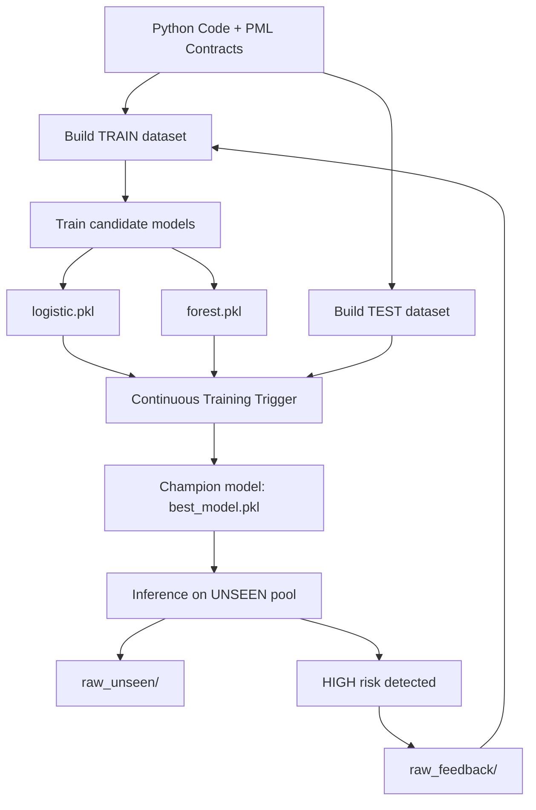

# SpecLens — Project Proposal and Development Plan

## 1. Project Summary

SpecLens-PML is an educational data-driven system that applies
Machine Learning and MLOps principles to the domain of software
correctness.

The project introduces PML (Python Modelling Language), a lightweight
specification language inspired by JML (Java Modelling Language) and by Python
contract libraries such as `icontract`.

SpecLens-PML supports:

- lightweight preconditions through `@requires`
- lightweight postconditions through `@ensures`
- class invariants through `@invariant`
- lightweight pre-state references through `old(...)`
- named pre-state snapshots through `@snapshot <name> = <expr>`

The system builds an end-to-end MLOps pipeline with feedback-driven retraining:

- Ingests Python code annotated with PML contracts
- Treats code and specifications as structured data
- Generates labeled datasets through dynamic execution and contract checking
- Trains multiple candidate machine learning models automatically (baseline + challenger)
- Evaluates candidates on a held-out TEST set, separate from training
- Selects and promotes a champion model based on a safety-oriented metric
- Serves predictions as operational risk scores (`LOW`, `MEDIUM`, `HIGH`)
- Runs inference on previously unseen code and collects feedback examples
- Stores generated dataset artifacts under `data/processed/`
- Exports DPG-ready training context for future structural explainability experiments
- Supports a simplified continuous learning loop (`train → test → promote → unseen → feedback → retrain`)

---

## 2. PML Syntax Examples

Contracts may be placed immediately above a definition or inside the function
body:

```python
def div(a, b):
    # @requires b != 0
    # @ensures result * b == a
    return a / b
```

Postconditions may refer to the pre-state of the current call through `old(...)`:

```python
def remove_last(items):
    # @requires len(items) > 0
    # @ensures len(result) == old(len(items)) - 1
    return items[:-1]
```

Named snapshots can capture pre-state values and make them available to
postconditions:

```python
def append_value(values, item):
    # @snapshot old_len = len(values)
    # @ensures len(result) == old_len + 1
    # @ensures result[-1] == item
    return values + [item]
```

Class invariants can also be expressed to capture persistent safety conditions:

```python
class Counter:
    # @invariant self.value >= 0

    def __init__(self, start):
        # @requires start >= 0
        self.value = start

    def decrement(self):
        # @requires self.value > 0
        # @ensures self.value >= 0
        self.value -= 1
        return self.value
```

Supported annotations:

- `@requires <expr>`: precondition
- `@ensures <expr>`: postcondition
- `@invariant <expr>`: class invariant
- `old(<expr>)`: lightweight pre-state reference
- `@snapshot <name> = <expr>`: named pre-state snapshot

The language intentionally remains lightweight and does not aim to implement the
full semantics of JML, `icontract`, or formal verification systems.

---

## 3. Project Deliverables

The implemented deliverables include:

- PML parser (`pml/parser.py`)
- Dataset generation pipeline (`pipeline/build_dataset.py`)
- Shared feature extraction schema (`pipeline/features.py`)
- Candidate model training (`pipeline/train.py`)
- Continuous Training Trigger (`ct_trigger.py`)
- Central governance configuration (`config.yaml`)
- Inference module (`inference/predict.py`)
- Containerized CI pipeline with Jenkins
- Streamlit web interface (`app.py`)
- Reproducibility and reset script (`reset.sh`)
- Adapted examples from the Python-by-Contract corpus
- DPG-ready training context sidecars for future structural explainability experiments
- Full documentation package:
  - Project Proposal and Development Plan
  - Operational Governance and Versioning Document
  - System Specification Document (SSD)
  - Sphinx-ready API documentation support

---

## 4. Development Milestones

The following milestones summarize the main implementation stages of
SpecLens-PML, from dataset preparation to continuous learning deployment and
documentation delivery:

- **M1** Dataset pipeline operational
- **M2** Baseline and challenger candidate models trained
- **M3** Held-out TEST dataset available for evaluation
- **M4** Champion promotion mechanism implemented
- **M5** Inference module producing operational risk levels: `LOW`, `MEDIUM`, `HIGH`
- **M6** Feedback loop integrated into training
- **M7** PML extended with `old(...)` and `@snapshot`
- **M8** Additional examples adapted from Python-by-Contract / `icontract`
- **M9** Feature schema extended with pre-state, snapshot, and AST structural features
- **M10** DPG-ready model context exported for future explainability analysis
- **M11** Final demo and documentation delivery

---

## 5. Work Breakdown Structure (WBS)

The Work Breakdown Structure below decomposes the project into its main
engineering areas, highlighting the corresponding tasks and produced artifacts:

| Area | Task | Output |
|------|------|--------|
| Parsing | PML contract extraction | Parsed specification units |
| Contract Language | Support `old(...)` and `@snapshot` | Extended lightweight PML syntax |
| Data Pipeline | Dynamic dataset generation | `TRAIN / TEST` CSV datasets |
| Feature Engineering | Structural and contract-aware features | Shared numeric feature schema |
| ML Kernel | Candidate model training | `logistic.pkl`, `forest.pkl` |
| DPG Preparation | Export model context | Feature names, training matrix, labels |
| Governance | Promotion trigger | `best_model.pkl` champion |
| Configuration | Continuous training policy rules | `config.yaml` |
| Inference | Risk scoring and classification | `LOW / MEDIUM / HIGH` levels |
| Feedback | High-risk unseen collection | `raw_feedback/` pool |
| CI | Containerized pipeline automation | Jenkins execution environment |
| Deployment | Streamlit application | `app.py` interface |
| Documentation | Technical reports | Submission package |

---

## 6. Operational Workflow Diagram (MLOps Lifecycle)

The full pipeline can be executed reproducibly from scratch using the provided
`reset.sh` script, which clears generated artifacts and resets the feedback loop
before a new run.

The following diagram represents the implemented operational lifecycle,
including the feedback loop that reinjects high-risk unseen examples into
training on subsequent runs:


```mermaid
flowchart TD

    A[Python Code + PML Contracts] --> B1[Build TRAIN dataset]
    A --> B2[Build TEST dataset]

    B1 --> D[Train candidate models]
    D --> E1[logistic.pkl]
    D --> E2[forest.pkl]

    E1 --> F[Continuous Training Trigger]
    E2 --> F
    B2 --> F

    F --> G[Champion model: best_model.pkl]

    G --> H[Inference on UNSEEN pool]
    H --> I[raw_unseen/]

    H --> J[HIGH risk detected]
    J --> K[raw_feedback/]

    K --> B1
```

This diagram represents the full implemented workflow: feedback examples are
collected and re-injected into TRAIN at the next run.

---

## 7. Iterative Sprint Plan

Development followed an iterative sprint-based organization:

| Sprint | Focus | Deliverable |
|--------|-------|------------|
| S1 | Parser + Features | Specification extraction |
| S2 | Dataset Builder | `TRAIN / TEST` dataset creation |
| S3 | Candidate Training | Baseline + challenger models |
| S4 | Governance Trigger | Champion promotion artifact |
| S5 | Inference + Feedback | Risk levels + feedback pool |
| S6 | CI + GUI + Documentation | Jenkins automation + Streamlit demo + final submission |
| S7 | Contract Extension | `old(...)` and `@snapshot` support |
| S8 | Dataset Expansion | Adapted Python-by-Contract examples |
| S9 | Explainability Preparation | DPG-ready model context and structural features |

---

## 8. Definition of Ready (DoR)

A sprint is ready to start when:

- Raw pools are available (`raw_train/`, `raw_test/`, `raw_unseen/`)
- System configuration is present (`config.yaml`)
- Dependencies are installed
- The repository state is clean
- Generated artifacts can be reset via `reset.sh`
- For dataset-extension tasks, candidate examples are compatible with the supported PML subset

---

## 9. Definition of Done (DoD)

A sprint is considered complete when:

- The pipeline is executed end-to-end via `demo.py`
- A promoted champion model is produced (`models/best_model.pkl`)
- Inference generates operational risk levels (`LOW / MEDIUM / HIGH`)
- Feedback examples are correctly collected in `raw_feedback/`
- Generated datasets are stored under `data/processed/`
- Feature extraction remains consistent between training, promotion, and inference
- Deliverables are reproducible and documented

---

## 10. Resources & Infrastructure

SpecLens-PML is designed as an educational yet realistic MLOps prototype and
relies on a lightweight but complete execution infrastructure. Non-functional
requirements emphasized in the project include reproducibility, portability, and
traceability through explicit dataset and model artifacts.

### Development Environment

- Python 3.10+ virtual environment (`.venv`)
- Modular repository organization (`pml/`, `pipeline/`, `inference/`)
- Package-style installation to ensure clean imports:

```bash
pip install -e .
```

### Execution and Reproducibility

- End-to-end reproducible runs through the CLI demo pipeline (`demo.py`)
- Repository reset support (`reset.sh`) to clean artifacts and rebuild from raw pools
- Generated datasets stored under `data/processed/`
- Temporary training staging performed through `data/_tmp_train/`

### CI Infrastructure

- Containerized Continuous Integration pipeline executed through Jenkins
- Streamlit-based GUI (`app.py`) providing an interactive entry point for inference and demonstrations
- Jenkins setup replicates the full training and evaluation workflow in an isolated environment

### Data and Model Artifacts

- Raw annotated example pools versioned in Git:
  - `raw_train/`
  - `raw_test/`
  - `raw_unseen/`
- Generated datasets stored as runtime CSV artifacts:
  - `data/processed/datasets_train.csv`
  - `data/processed/datasets_test.csv`
- Candidate and champion models stored as serialized runtime artifacts in `models/`
- DPG-ready model context sidecars generated during training:
  - `models/logistic_training_context.pkl`
  - `models/forest_training_context.pkl`

### Documentation Tooling

- Developer-oriented API documentation supported through Sphinx (`docs/`)
- Manual API index provided via `api.rst` for the core modules

---

## 11. Current Extension Toward Thesis Work

The current version of SpecLens-PML introduces two thesis-oriented extensions:

1. **Richer contract support** through `old(...)` and `@snapshot`, enabling
   lightweight reasoning about pre-state values while preserving readability.

2. **Preparation for structural explainability** through DPG-ready context files
   and a feature schema that includes contract-aware, pre-state, snapshot, and
   structural AST features.

These extensions support the broader thesis direction: explainable and
controllable risk assessment of Python functions with lightweight contracts.
