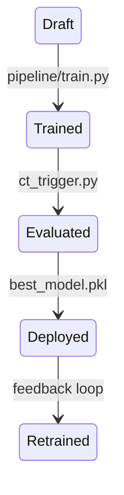
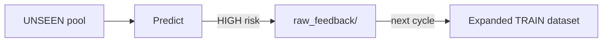

# SpecLens — Operational Governance and Versioning Document

## 1. Governance Scope

SpecLens-PML implements an educational governance strategy focused on:

- Candidate vs champion separation
- Metric-driven promotion (automatic champion selection based on recall on the RISKY class)
- Policy-driven governance thresholds defined in configuration (`config.yaml`)
- Controlled serving through a single deployed artifact (`best_model.pkl`)
- Automated CI execution via containerized Jenkins pipeline
- Operational access through a minimal Streamlit GUI (`app.py`) for interactive inference and demos
- Feedback collection for continuous retraining
- Reproducibility through reset and deterministic execution flow

The system does not include a full enterprise model registry: the promoted champion artifact is updated at each evaluation cycle.

---

## 2. Managed Artifacts

The SpecLens-PML codebase is modular and fully versioned:

- Modular repository structure (`pipeline/`, `inference/`, `pml/`)  
- Versioned through Git commits

Training and held-out TEST datasets are generated as CSV artifacts during each pipeline execution:

  - `data/datasets_train.csv`
  - `data/datasets_test.csv`

Raw pools remain immutable:

- `raw_train/`, `raw_test/`, `raw_unseen/`

Feedback pool evolves over time:

- `raw_feedback/`

The training stage produces multiple candidate model artifacts, while governance promotes a single champion model used for operational serving:

| Type | Artifact | Role |
|------|----------|------|
| Candidate | `logistic.pkl` | Baseline model |
| Candidate | `forest.pkl` | Challenger model |
| Champion | `best_model.pkl` | Single serving model |

---

## 3. Model Lifecycle Governance

The following state diagram summarizes the governance lifecycle of SpecLens-PML models, from initial training to evaluation, champion deployment and feedback-driven retraining:



The lifecycle enforces separation between:

- Training artifacts (candidates)  
- Production artifact (champion)  

---

## 4. Champion / Challenger Promotion Policy

Promotion is implemented in `ct_trigger.py`:

- Load candidate models  
- Evaluate on held-out TEST dataset  
- Compute recall on the RISKY class  
- Promote the best candidate (`models/best_model.pkl`)

This governance rule ensures:

- Controlled deployment  
- Safety-oriented selection  
- Explicit separation between TRAIN and TEST  

---

## 5. Feedback-Driven Continuous Training Policy

Inference is performed on the UNSEEN pool:

- `data/raw_unseen/`

If a function is classified as HIGH risk, the corresponding file is copied into:

- `data/raw_feedback/`

The training pool evolves iteratively:

- The next training set is built by merging the original raw training pool with the accumulated feedback examples
- The feedback pool grows by adding unseen inputs classified as HIGH risk

The diagram below illustrates how high-risk unseen inputs are collected into the feedback pool and reinjected into the training dataset in the next continuous learning cycle:



---

## 6. Reproducibility and Reset Controls

The full pipeline can be executed from scratch via:

```bash
./reset.sh
python3 demo.py
```

Reset removes:

- Feedback examples collected in `raw_feedback/`
- Temporary training staging directory (`data/_tmp_train/`)
- Generated TRAIN / TEST datasets (`datasets_train.csv`, `datasets_test.csv`)
- Trained candidate and champion model artifacts (`logistic.pkl`, `forest.pkl`, `best_model.pkl`)

Raw pools remain untouched, ensuring reproducible rebuilds.

---

## 7. CI and Automation

SpecLens-PML integrates automation through:

- `demo.py` for end-to-end continuous training runs  
- `ct_trigger.py` for automated governance promotion  
- Jenkins integration for CI execution of the full workflow (executed inside a Docker container, ensuring that the full pipeline can be replicated in an isolated environment outside the developer’s local machine)
- Streamlit GUI (`app.py`) as an operational control interface  

Full experiment tracking (e.g., Neptune.ai, MLflow) is not integrated in this prototype, but represents a natural extension for richer metric dashboards and lineage tracking.

---

## 8. Monitoring and Maintenance Plan

Monitoring is implemented through governance-driven signals.

Instead of relying on external observability stacks (e.g., Prometheus, Grafana), the system reacts to:

- Performance degradation (measured through recall on the held-out TEST dataset)
- An increase of HIGH-risk predictions on unseen code submitted by developers (these cases are collected as feedback examples to improve future training cycles)
- Potential drift in specification patterns can also be monitored.
  In case of suspected drift (i.e., incoming code / specification patterns differing in number and complexity from the training distribution), 
  SpecLens-PML does not implement a dedicated drift detection service, but addresses the issue through its feedback-driven retraining mechanism: 
  new representative examples can be collected and the pipeline re-executed to realign the model with evolving specification structures:

| Signal | Response Action |
|--------|----------------|
| Recall drop on TEST | The current champion remains active and is not replaced |
| Surge of HIGH-risk unseen cases | Expand feedback pool |
| Drift suspicion | Trigger retraining cycle |

The feedback mechanism provides a lightweight proxy for production monitoring in an educational setting.

---

## 9. Event Log Schema

To support future traceability and potential process mining extensions, the workflow could be represented as an event log:

| timestamp | case_id | activity | artifact | outcome |
|----------|---------|----------|----------|---------|
| t1 | demo_run | train | datasets_train.csv | success |
| t2 | demo_run | evaluate | datasets_test.csv | recall=<measured_value> |
| t3 | demo_run | promote | best_model.pkl | deployed |

---

## 10. Example Operational Use Case

A typical end-to-end interaction scenario is:

- A developer submits Python code annotated with PML contracts  
- The system performs inference using the deployed champion model  
- If the risk level is classified as HIGH, the file is copied into the feedback pool  
- The feedback pool is automatically incorporated into the next training cycle  

This lightweight scenario provides a simple form of system modeling and traceability aligned with classical Software Engineering practices.

