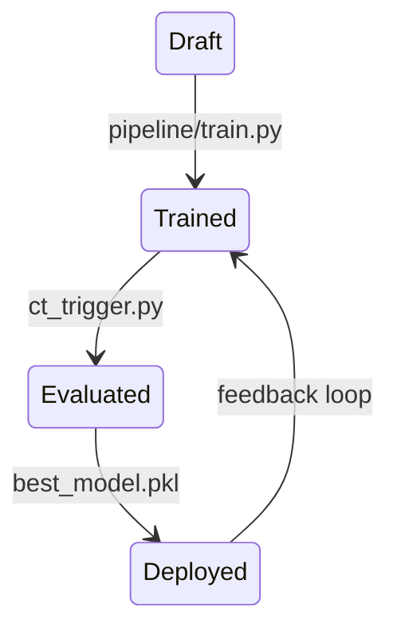
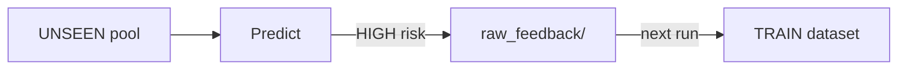

# SpecLens — Operational Governance & Model Management

## 1. Governance Scope

SpecLens-PML implements a simplified governance strategy focused on:

- candidate vs champion separation  
- metric-driven promotion  
- feedback collection for retraining  
- reproducible reset and rerun  

The project does not implement a full enterprise registry:
the champion artifact is overwritten at each promotion.

---

## 2. Managed Artifacts (as implemented)

### Code
- modular repository structure (`pipeline/`, `inference/`, `pml/`)

### Data
- generated datasets:
  - `data/datasets_train.csv`
  - `data/datasets_test.csv`

### Models
- candidates:
  - `models/logistic.pkl` (baseline)
  - `models/forest.pkl` (challenger)

- champion:
  - `models/best_model.pkl` (serving artifact)

---

## 3. Model Lifecycle



---

## 4. Champion/Challenger Promotion Policy

`ct_trigger.py` closes the loop:

1. Loads candidate models (`logistic`, `forest`)
2. Evaluates both on the held-out TEST dataset
3. Computes Recall on the RISKY class
4. Promotes the best candidate to:

```
models/best_model.pkl
```

This ensures:

- controlled deployment  
- metric-driven governance  
- explicit separation between training and serving  

---

## 5. Feedback Collection

Inference is performed on the UNSEEN pool:

- `data/raw_unseen/`

If HIGH risk is detected, files are copied into:

- `data/raw_feedback/`

These examples are automatically folded into TRAIN at the next demo run.



---

## 6. Reproducibility Controls

The pipeline can be executed from scratch via:

```bash
./reset.sh
python3 demo.py
```

Reset removes:

- feedback pool  
- generated datasets  
- trained candidate + champion models  

Raw pools remain untouched.

---

## 7. Educational Scope

The governance loop demonstrates real MLOps principles:

- train/test separation  
- promotion as governance decision  
- single serving artifact  
- feedback-driven improvement  

The focus is architecture and lifecycle management, not state-of-the-art performance.
