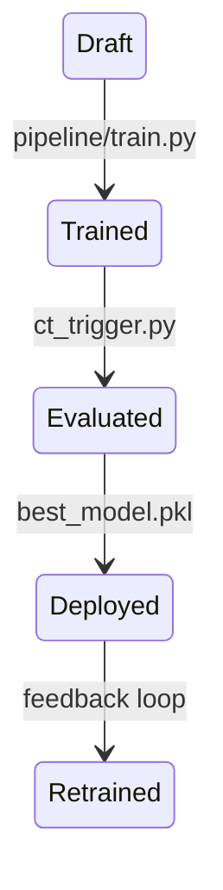
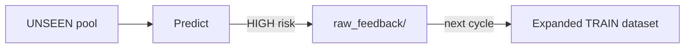

# SpecLens — Operational Governance & Versioning Document

## 1. Governance Scope

SpecLens-PML implements an educational governance strategy focused on:

- candidate vs champion separation  
- metric-driven promotion  
- controlled serving through a single deployed artifact  
- feedback collection for continuous retraining  
- reproducibility through reset and deterministic execution flow  

The system does not include a full enterprise model registry: the promoted champion artifact is updated at each evaluation cycle.

---

## 2. Managed Artifacts

### Code Artifacts
- Modular repository structure (`pipeline/`, `inference/`, `pml/`)  
- Versioned through Git commits and tagged releases  

### Data Artifacts
- Generated datasets:
  - `data/datasets_train.csv`
  - `data/datasets_test.csv`

Raw pools remain immutable:

- `raw_train/`, `raw_test/`, `raw_unseen/`

Feedback pool evolves over time:

- `raw_feedback/`

### Model Artifacts

| Type | Artifact | Role |
|------|----------|------|
| Candidate | `logistic.pkl` | Baseline model |
| Candidate | `forest.pkl` | Challenger model |
| Champion | `best_model.pkl` | Single serving model |

---

## 3. Model Lifecycle Governance



The lifecycle enforces separation between:

- **training artifacts** (candidates)  
- **production artifact** (champion)  

---

## 4. Champion/Challenger Promotion Policy

Promotion is implemented in `ct_trigger.py`:

1. Load candidate models  
2. Evaluate on held-out TEST dataset  
3. Compute Recall on the *RISKY* class  
4. Promote the best candidate to:

```
models/best_model.pkl
```

This governance rule ensures:

- controlled deployment  
- safety-oriented selection  
- explicit separation between TRAIN and TEST  

---

## 5. Feedback-Driven Continuous Training Policy

Inference is performed on the UNSEEN pool:

- `data/raw_unseen/`

If a function is classified as HIGH risk, the corresponding file is copied into:

- `data/raw_feedback/`

The training pool evolves as:

\[
TRAIN_{t+1} = RAW\_TRAIN \cup FEEDBACK_t
\]

\[
FEEDBACK_{t+1} = FEEDBACK_t \cup \{x \in UNSEEN : risk(x)=HIGH\}
\]



---

## 6. Reproducibility and Reset Controls

The full pipeline can be executed from scratch via:

```bash
./reset.sh
python3 demo.py
```

Reset removes:

- feedback pool  
- generated datasets  
- trained candidate and champion artifacts  

Raw pools remain untouched, ensuring reproducible rebuilds.

---

## 7. CI/CD and Automation

SpecLens-PML integrates automation through:

- `demo.py` for end-to-end continuous training runs  
- `ct_trigger.py` for automated governance promotion  
- Streamlit GUI (`app.py`) as an operational control interface  
- Jenkins integration (optional) for CI execution of the full workflow  

- Jenkins is executed inside a Docker container, ensuring that the full pipeline can be replicated in an isolated environment outside the developer’s local machine.

---

## 8. Monitoring and Maintenance Plan

Monitoring is implemented through governance signals:

| Signal | Response Action |
|--------|----------------|
| Recall drop on TEST | Block champion promotion |
| Surge of HIGH-risk unseen cases | Expand feedback pool |
| Drift suspicion in specification patterns | Trigger retraining cycle |

The feedback mechanism provides a lightweight proxy for production monitoring in an educational setting.

---

## 9. Event Log Schema (Process Mining Ready)

To support traceability, the workflow can be represented as an event log:

| timestamp | case_id | activity | artifact | outcome |
|----------|---------|----------|----------|---------|
| t1 | model_v1 | train | datasets_train.csv | success |
| t2 | model_v1 | evaluate | datasets_test.csv | recall=0.72 |
| t3 | model_v1 | promote | best_model.pkl | deployed |

This schema enables future extensions with process mining and compliance auditing.


## 10. Example Operational Use Case

A typical end-to-end interaction scenario is:

- A developer submits Python code annotated with PML contracts  
- The system performs inference using the deployed champion model  
- If the risk level is classified as **HIGH**, the file is copied into the feedback pool  
- The feedback pool is automatically incorporated into the next training cycle  

This lightweight scenario provides a simple form of system modeling and traceability aligned with classical Software Engineering practices.

