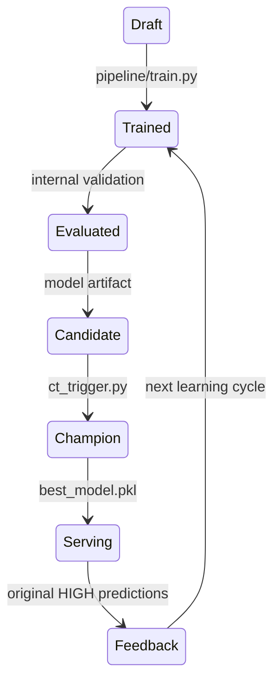

# SpecLens — Operational Governance and Concept-Aware Control

## 1. Governance Scope

SpecLens-PML implements a lightweight governance architecture for
contract-based software risk assessment.

The architecture separates five elements that must not be conflated:

1. the trained model and its probability score;
2. the original operational risk decision;
3. software-engineering concepts extracted from model features;
4. human-defined control policies;
5. human review and final governance actions.

The core invariant is:

> Control policies never modify the trained model or its probability score.

Policies may only make the operational HIGH-risk threshold more conservative.
This preserves the distinction between model prediction and governance
intervention.

SpecLens-PML currently provides:

- candidate/champion model separation;
- recall-oriented model promotion;
- feature-level and DPG-based structural explainability;
- deterministic mapping from model features to software-engineering concepts;
- concept-aware operational control policies;
- quantitative policy predicates derived from DPG evidence;
- append-only control-event logging;
- explicit human APPROVE and OVERRIDE actions;
- feedback-driven continuous retraining;
- a simplified `speclens` orchestration interface;
- deterministic reset and reproducible execution.

---

## 2. Governed Decision Pipeline

Operational inference follows this sequence:

```text
Python + PML contracts
        |
        v
feature extraction
        |
        v
trained champion model
        |
        v
model probability score
        |
        v
original operational risk level
        |
        v
software-engineering concept states
        |
        v
human-defined policy matching
        |
        v
controlled HIGH threshold
        |
        v
controlled risk level
        |
        v
audit event
        |
        v
optional human APPROVE / OVERRIDE
```

The model score remains unchanged throughout the entire control and review
process.

In the current configuration:

- score < 0.20 -> LOW;
- 0.20 <= score < 0.60 -> MEDIUM;
- score >= 0.60 -> HIGH.

A matched policy may reduce the HIGH threshold, but it cannot increase it above
the baseline value.

### Simplified operational interface

The recommended human-facing interface is the repository-level `speclens`
command:

```bash
./speclens reset
./speclens run
./speclens control
./speclens govern
./speclens all
```

The interface is an orchestration/presentation layer. It does not duplicate or
replace the underlying model, DPG, control, or review logic.

Its main roles are:

```text
run
  -> build/train/evaluate/promote/infer/feedback

control
  -> DPG/explain/concepts/control evaluation/graph

govern
  -> governed inference/evidence/human review

all
  -> complete demonstration workflow
```

Lower-level scripts such as `demo.py`, `experiments/dpg_explain_forest.py`,
`experiments/evaluate_control.py`, `inference/predict.py`, and
`governance/review.py` remain the backend/developer interfaces.

---

## 3. Model Lifecycle Governance

Candidate models are trained independently and evaluated before promotion.

The current pipeline trains:

- Logistic Regression;
- Random Forest.

Promotion is implemented by `ct_trigger.py`.

The candidate with the highest recall on the RISKY class is promoted as:

```text
models/best_model.pkl
```

The serving model and the model used for structural explanation need not be the
same artifact.

In particular, the Random Forest candidate is used for Decision Predicate Graph
analysis because its tree structure exposes explicit decision predicates even
when Logistic Regression is the operational champion.


```mermaid
stateDiagram-v2
  Draft --> Trained : pipeline/train.py
  Trained --> Evaluated : internal validation
  Evaluated --> Candidate : model artifact
  Candidate --> Champion : ct_trigger.py
  Champion --> Serving : best_model.pkl
  Serving --> Feedback : original HIGH predictions
  Feedback --> Trained : next learning cycle
```

---

## 4. Explainability and Decision Predicate Graphs

SpecLens-PML provides structural explanation through Decision Predicate Graphs
(DPGs) extracted from the Random Forest candidate.

The DPG analysis preserves decision predicates and transition structure from
tree execution paths.

The recommended user-facing command is:

```bash
./speclens control
```

It generates the DPG, class-aware community summaries, concept-level
interpretation, control evaluation, and opens the simplified global graph.

The underlying analysis pipeline remains:

```bash
python3 experiments/dpg_explain_forest.py \
  --render-simplified-global \
  --top-k-nodes 15 \
  --node-metric local_reaching \
  --max-edges 25 \
  --render-community-summary

python3 experiments/dpg_concept_analysis.py
```

A representative current run produced:

- 70 model-training samples;
- 32 features;
- 200 Random Forest estimators;
- 14,000 decision paths;
- 240 DPG nodes;
- 2,891 DPG edges;
- 2 class-aware communities.

The compact RISKY-dominant community showed an 85.7% RISKY class association,
while the broader SAFE-dominant community showed a 69.0% SAFE association.

These associations are descriptive. They must not be interpreted as causal
relationships between software-engineering concepts and correctness risk.

---

## 5. Software-Engineering Concept Layer

Low-level model features and DPG predicates are mapped to deterministic
software-engineering concept families.

The shared taxonomy is defined in:

```text
governance/concepts.py
```

It is used both by:

```text
experiments/dpg_concept_analysis.py
```

and by the operational control layer.

Representative mappings include:

```text
has_subscript
    -> INDEX_ACCESS

n_requires
    -> PRECONDITION_COVERAGE

n_contracts_total
    -> CONTRACT_COVERAGE

ensures_complexity
    -> POSTCONDITION_COMPLEXITY

n_loc
    -> STRUCTURAL_SIZE

has_prestate_reference
    -> PRESTATE_REASONING

has_snapshot
    -> SNAPSHOT_USAGE
```

This shared taxonomy prevents the explanation and control layers from using
independent or inconsistent concept definitions.

---

## 6. Concept-Aware Control Policies

Policies are defined in:

```text
governance/policies.yaml
```

The current policy configuration is version 2.

Two policy representations are supported.

### 6.1 Concept-state conditions

Boolean or presence-oriented concepts can be expressed as:

```yaml
when:
  INDEX_ACCESS: present
  MISSING_PRECONDITION_COVERAGE: present
```

### 6.2 Quantitative concept predicates

DPG threshold evidence can be preserved directly:

```yaml
when:
  - concept: CONTRACT_COVERAGE
    feature: n_contracts_total
    operator: "<="
    value: 2.5

  - concept: POSTCONDITION_COMPLEXITY
    feature: ensures_complexity
    operator: ">"
    value: 9.5
```

The concept label provides a software-engineering interpretation while the
feature/operator/value tuple preserves the quantitative predicate.

---

## 7. Current Policy Set

### P001 — Indexed access without precondition coverage

```text
INDEX_ACCESS = present
AND
MISSING_PRECONDITION_COVERAGE = present
```

Controlled HIGH threshold:

```text
0.50
```

P001 was introduced initially to validate the concept-state control
architecture.

It should not by itself be interpreted as a statistically validated risk rule.

### P002 — Limited contract coverage with complex postcondition

```text
n_contracts_total <= 2.5
AND
ensures_complexity > 9.5
```

Associated concepts:

```text
CONTRACT_COVERAGE
POSTCONDITION_COMPLEXITY
```

Controlled HIGH threshold:

```text
0.50
```

### P003 — Larger function with complex postcondition

```text
n_loc > 6.5
AND
ensures_complexity > 9.5
```

Associated concepts:

```text
STRUCTURAL_SIZE
POSTCONDITION_COMPLEXITY
```

Controlled HIGH threshold:

```text
0.50
```

P002 and P003 were constructed from DPG structural evidence and selected using
the internal TRAIN-derived validation split.

They are human-defined governance policies informed by model explanation. They
are not automatically learned causal rules.

---

## 8. Validation-Based Policy Selection

The TRAIN dataset contains 100 functions.

`pipeline/train.py` deterministically creates:

```text
70 model-training cases
30 internal validation cases
```

using:

```python
train_test_split(
    ...,
    test_size=0.3,
    random_state=42,
    stratify=y,
)
```

The 30 validation cases were used to assess candidate policy conditions.

Under the baseline operational HIGH threshold of 0.60:

| Metric | Baseline |
|---|---:|
| RISKY recall | 0.273 |
| RISKY precision | 0.500 |
| RISKY F1 | 0.353 |
| False negatives | 8 |
| False positives | 3 |

After concept-aware control:

| Metric | Controlled |
|---|---:|
| RISKY recall | 0.545 |
| RISKY precision | 0.667 |
| RISKY F1 | 0.600 |
| False negatives | 5 |
| False positives | 3 |

Three validation decisions changed from MEDIUM to HIGH.

All three corresponded to RISKY-labelled cases.

---

## 9. Evaluation on the Current TEST Split

The current TEST dataset contains 25 cases.

With the baseline HIGH threshold of 0.60:

| Metric | Baseline |
|---|---:|
| Accuracy | 0.840 |
| RISKY recall | 0.500 |
| RISKY precision | 1.000 |
| RISKY F1 | 0.667 |
| False negatives | 4 |
| False positives | 0 |

With policy version 2:

| Metric | Controlled |
|---|---:|
| Accuracy | 0.920 |
| RISKY recall | 0.750 |
| RISKY precision | 1.000 |
| RISKY F1 | 0.857 |
| False negatives | 2 |
| False positives | 0 |

Two operational decisions changed:

```text
keys_count
    score: 0.555
    MEDIUM -> HIGH
    policy: P002

update_value
    score: 0.589
    MEDIUM -> HIGH
    policies: P002 + P003
```

The model scores were not changed.

---

## 10. Comparison with Global Threshold Reduction

A global HIGH threshold of 0.50 was also evaluated as a diagnostic baseline.

On both the current internal validation split and the current TEST split,
global thresholding at 0.50 produced the same predictive metrics and final
HIGH/not-HIGH decisions as the current policy-controlled configuration.

Therefore, the present experiments do **not** demonstrate predictive
superiority of concept-aware policies over global threshold tuning.

The demonstrated contribution of the control layer is instead that intervention
is:

- conditional rather than globally applied;
- explicitly connected to software-engineering concepts;
- supported by inspectable predicate evidence;
- versioned through human-defined policies;
- auditable;
- subject to human approval or override.

This distinction is essential when reporting experimental results.

---

## 11. Governance Audit Trail

Matched policies are recorded in an append-only JSONL audit log:

```text
data/governance/control_events.jsonl
```

Runtime audit logs are intentionally ignored by Git.

A control event records information including:

- event identifier;
- timestamp;
- source file;
- function name;
- model score;
- original risk level;
- relevant concepts;
- matched policy identifiers;
- policy evidence;
- original HIGH threshold;
- controlled HIGH threshold;
- controlled risk level;
- whether the decision changed;
- whether human review is required;
- policy version.

A policy match can be audited even when it does not change the decision.

Human review is required only when a matched policy actually changes the
operational risk level and the policy is configured with
`require_review: true`.

---

## 12. Human Review and Override

Human review is implemented by:

```text
governance/review.py
```

A controlled decision may be explicitly approved through the simplified CLI:

```bash
./speclens govern \
  --approve EVENT_ID \
  --reason "Policy evidence reviewed."
```

or overridden:

```bash
./speclens govern \
  --override EVENT_ID MEDIUM \
  --reason "Manual review accepts the original MEDIUM level."
```

The lower-level `governance/review.py` interface remains available for direct
developer use.

An override requires an explicit rationale.

Human review does not mutate the original control event. Instead, a new
`human_review` record is appended to the same audit log.

This produces an append-only decision history:

```text
model decision
    ->
control event
    ->
human review
```

The system therefore preserves both the machine/policy decision and subsequent
human intervention.

---

## 13. Feedback Isolation

The continuous-learning feedback loop intentionally uses the **original model
risk level**, not the policy-controlled level.

Only output containing:

```text
Original risk level: HIGH
```

is eligible for automatic feedback collection.

A function escalated from MEDIUM to HIGH by a governance policy therefore does
not silently become a new training example.

This prevents human-defined control rules from contaminating future model
training labels and preserves separation between:

```text
model learning
```

and:

```text
operational governance
```

---

## 14. Reproducibility and Runtime Artifacts

The recommended reset command is:

```bash
./speclens reset
```

A clean end-to-end run can be started directly with:

```bash
./speclens run
```

`./speclens run` performs the reset automatically. The lower-level `reset.sh`
script remains the backend implementation.

The reset removes:

- feedback examples;
- temporary training artifacts;
- generated TRAIN and TEST datasets;
- trained model artifacts;
- generated DPG outputs;
- governance runtime audit events;
- generated control-evaluation outputs.

The following runtime artifacts are ignored by Git:

```text
data/governance/*.jsonl
experiments/dpg_outputs/
experiments/control_outputs/
```

Versioned raw inputs and governance policy definitions remain preserved:

```text
data/raw_train/
data/raw_test/
data/raw_unseen/
governance/policies.yaml
```

---

### Recommended complete demonstration

The complete operational demonstration can be run step by step:

```bash
./speclens run
./speclens control
./speclens govern
```

or in one command:

```bash
./speclens all
```

The `control` command opens the simplified global DPG automatically when the
desktop environment supports it. The latest graph can be reopened with:

```bash
./speclens graph
```

The simplified CLI is intended to improve usability and presentation only; it
does not alter model probabilities, DPG construction, governance policies,
evaluation semantics, or the append-only review model.

---

## 15. Automated Tests

Governance behavior is covered by unit tests in:

```text
tests/test_governance.py
```

The current suite verifies:

- P001 concept-state escalation;
- quantitative P002 matching;
- quantitative P003 matching;
- unchanged model score after control;
- preservation of the baseline when no policy matches;
- rejection of less-conservative policies;
- review only when a policy changes the decision;
- append-only control and human-review records.

Run with:

```bash
python3 -m unittest discover \
  -s tests \
  -p 'test_governance.py' \
  -v
```

---

## 16. Experimental Limitations

The current results should be interpreted as prototype-scale evidence.

Important limitations include:

- a relatively small dataset;
- policies currently derived from a small number of software examples;
- DPG associations are descriptive rather than causal;
- policy effectiveness may depend on the model and dataset distribution;
- the current TEST split was inspected during development.

For final publication-grade evaluation, policy definitions should be frozen
before evaluation on a fresh, untouched holdout or through an appropriate
repeated evaluation protocol.

The current TEST results remain useful as engineering evidence and as a
demonstration of the control/governance architecture, but should not be
overstated as an uncontaminated final benchmark.

---

## 17. Governance Principle

SpecLens-PML intentionally separates:

```text
model score
    !=
operational decision
    !=
policy intervention
    !=
human decision
```

Explainability makes model decision structures inspectable.

Controllability allows explicit human-defined policies to influence operational
risk decisions without changing the trained model.

Governability provides traceability, review, approval, override, policy
versioning, and an auditable record of those interventions.

Together, these mechanisms provide a lightweight architecture for explainable,
controllable, and governable software-risk assessment.
