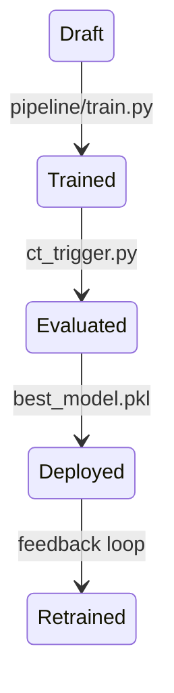
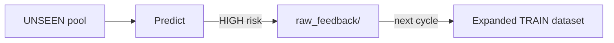

# SpecLens — Operational Governance and Versioning Document

## 1. Governance Scope

SpecLens-PML implements an educational governance strategy focused on:

- Candidate vs champion separation
- Metric-driven promotion based on recall on the RISKY class
- Policy-driven governance thresholds defined in configuration (`config.yaml`)
- Controlled serving through a single deployed artifact (`best_model.pkl`)
- Automated CI execution via a containerized Jenkins pipeline
- Operational access through a minimal Streamlit GUI (`app.py`) for interactive inference and demos
- Feedback collection for continuous retraining
- Reproducibility through reset and deterministic execution flow
- Separation between raw data, generated datasets, and generated model artifacts
- Preparation for future structural explainability through DPG-ready training context

The system does not include a full enterprise model registry. The promoted
champion artifact is updated at each evaluation cycle.

---

## 2. Managed Artifacts

The SpecLens-PML codebase is modular and versioned through Git:

- `pipeline/`
- `inference/`
- `pml/`
- `data/raw_train/`
- `data/raw_test/`
- `data/raw_unseen/`
- documentation files

Training and held-out TEST datasets are generated as CSV artifacts during each
pipeline execution:

- `data/processed/datasets_train.csv`
- `data/processed/datasets_test.csv`

Raw pools remain versioned and stable:

- `data/raw_train/`
- `data/raw_test/`
- `data/raw_unseen/`

The feedback pool evolves over time:

- `data/raw_feedback/`

The training stage produces multiple candidate model artifacts, while governance
promotes a single champion model used for operational serving:

| Type | Artifact | Role |
|------|----------|------|
| Candidate | `models/logistic.pkl` | Baseline model |
| Candidate | `models/forest.pkl` | Challenger model and tree-based model for future DPG analysis |
| Champion | `models/best_model.pkl` | Single serving model |
| Context | `models/logistic_training_context.pkl` | Feature names, training matrix, labels |
| Context | `models/forest_training_context.pkl` | DPG-ready context for tree-based explanation experiments |

Generated datasets and model artifacts are runtime outputs and should normally
be ignored by Git.

---

## 3. Model Lifecycle Governance

The following state diagram summarizes the governance lifecycle of SpecLens-PML
models, from initial training to evaluation, champion deployment, and
feedback-driven retraining:


```mermaid
stateDiagram-v2
  Draft --> Trained : pipeline/train.py
  Trained --> Evaluated : ct_trigger.py
  Evaluated --> Deployed : best_model.pkl
  Deployed --> Retrained : feedback loop
```

The lifecycle enforces separation between:

- Training artifacts, represented by candidate models
- The deployed serving artifact, represented by the champion model
- Raw data pools and generated datasets
- Operational inference and future feedback collection

---

## 4. Champion / Challenger Promotion Policy

Promotion is implemented in `ct_trigger.py`.

The trigger performs the following steps:

- Load candidate models
- Evaluate each candidate on the held-out TEST dataset
- Compute recall on the RISKY class
- Promote the candidate with the best RISKY-class recall as `models/best_model.pkl`

This governance rule ensures:

- Controlled deployment
- Safety-oriented selection
- Explicit separation between TRAIN and TEST
- A single active serving artifact

The Random Forest candidate may also be used for structural explainability
experiments through Decision Predicate Graphs, even when the promoted operational
champion is a different model according to the governance metric.

---

## 5. Feedback-Driven Continuous Training Policy

Inference is performed on the UNSEEN pool:

- `data/raw_unseen/`

If a function is classified as HIGH risk, the corresponding file is copied into:

- `data/raw_feedback/`

The training pool evolves iteratively:

- The next training set is built by merging the original raw training pool with accumulated feedback examples
- The feedback pool grows by adding unseen inputs classified as HIGH risk

The diagram below illustrates how high-risk unseen inputs are collected into the
feedback pool and reinjected into the training dataset in the next continuous
learning cycle:


```mermaid
flowchart LR
  U[UNSEEN pool] --> P[Predict]
  P -->|HIGH risk| F[raw_feedback/]
  F -->|next cycle| T[Expanded TRAIN dataset]
```

---

## 6. Reproducibility and Reset Controls

The full pipeline can be executed from scratch via:

```bash
./reset.sh
python3 demo.py
```

Reset removes:

- Feedback examples collected in `raw_feedback/`
- Temporary training staging directory (`data/_tmp_train/`)
- Generated TRAIN / TEST datasets under `data/processed/`
- Trained candidate and champion model artifacts under `models/`

Raw pools remain untouched, ensuring reproducible rebuilds.

---

## 7. CI and Automation

SpecLens-PML integrates automation through:

- `demo.py` for end-to-end continuous training runs
- `ct_trigger.py` for automated governance promotion
- Jenkins integration for CI execution of the full workflow
- Streamlit GUI (`app.py`) as an operational control interface

The Jenkins workflow is executed inside a Docker container, ensuring that the
full pipeline can be replicated in an isolated environment outside the
developer's local machine.

Full experiment tracking, for example Neptune.ai or MLflow, is not integrated in
this prototype, but represents a natural extension for richer metric dashboards,
lineage tracking, and collaborative governance.

---

## 8. Monitoring and Maintenance Plan

Monitoring is implemented through governance-driven signals.

Instead of relying on external observability stacks, the system reacts to:

- Performance degradation, measured through recall on the held-out TEST dataset
- An increase of HIGH-risk predictions on unseen code submitted by developers
- Potential drift in coding or specification patterns

In case of suspected drift, SpecLens-PML does not implement a dedicated drift
detection service. Instead, the issue is addressed through its feedback-driven
retraining mechanism: new representative examples can be collected and the
pipeline re-executed to realign the model with evolving specification structures.

| Signal | Response Action |
|--------|----------------|
| Recall drop on TEST | The current champion remains active and is not replaced |
| Surge of HIGH-risk unseen cases | Expand feedback pool |
| Drift suspicion | Trigger retraining cycle |
| New contract patterns | Extend raw examples and retrain |
| Explanation mismatch | Inspect feature schema and future DPG explanation layer |

The feedback mechanism provides a lightweight proxy for production monitoring in
an educational setting.

---

## 9. Event Log Schema

To support future traceability and potential process mining extensions, the
workflow could be represented as an event log:

| timestamp | case_id | activity | artifact | outcome |
|----------|---------|----------|----------|---------|
| t1 | demo_run | train | datasets_train.csv | success |
| t2 | demo_run | evaluate | datasets_test.csv | recall=<measured_value> |
| t3 | demo_run | promote | best_model.pkl | deployed |
| t4 | demo_run | explain | forest_training_context.pkl | DPG-ready |

---

## 10. Example Operational Use Case

A typical end-to-end interaction scenario is:

- A developer submits Python code annotated with PML contracts
- The system performs inference using the deployed champion model
- If the risk level is classified as HIGH, the file is copied into the feedback pool
- The feedback pool is incorporated into the next training cycle
- Future explanation layers can inspect tree-based model decisions through DPG-ready context files

This lightweight scenario provides a simple form of system modeling and
traceability aligned with classical Software Engineering practices.

---

## 11. Governability and Future Explainability Support

SpecLens-PML currently implements governability through:

- explicit TRAIN / TEST separation
- champion / challenger model selection
- recall-oriented promotion
- policy thresholds in `config.yaml`
- feedback-driven retraining
- a single serving artifact

The latest version also prepares the project for future explainability and
governability analysis by storing model context files with feature names,
training features, and training labels. These artifacts can be used to construct
Decision Predicate Graphs for tree-based models, supporting inspection of
structural decision predicates behind RISKY predictions.
