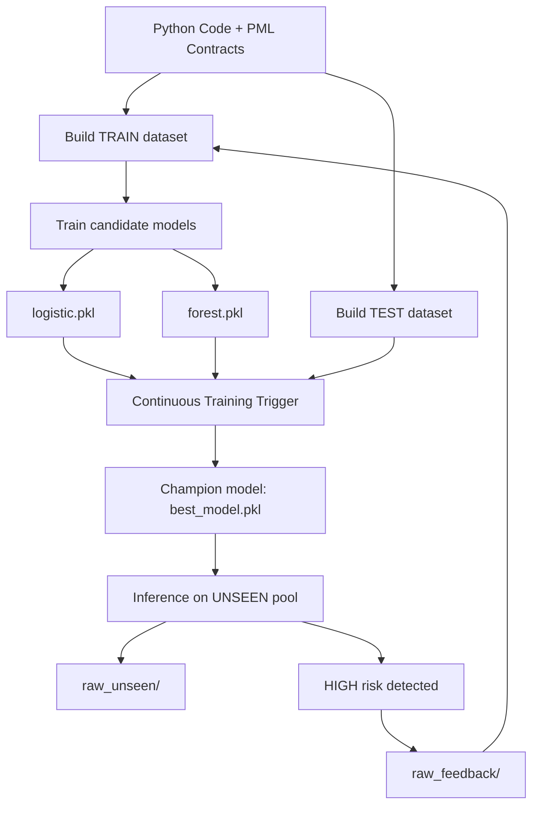

# SpecLens — System Specification Document (SSD)

## 1. Problem Definition

**SpecLens-PML** is an educational data-driven system that applies
Machine Learning and MLOps principles to the domain of **software correctness**.

The project introduces **PML (Python Modelling Language)**, a lightweight specification language inspired by JML,
and builds an end-to-end **MLOps pipeline with feedback-driven retraining**.

The system analyzes Python functions and methods annotated with PML contracts:

- `@requires` (preconditions)
- `@ensures` (postconditions)
- `@invariant` (class invariants)

It predicts whether a given specification is:

- **SAFE (0)** — contracts hold under observed executions
- **RISKY (1)** — contract violations or runtime failures are observed

This is formulated as a **binary classification task**:

- Input: structural feature vector extracted from a PML unit  
- Output: risk probability + operational level (`LOW`, `MEDIUM`, `HIGH`)

> SpecLens-PML provides a probabilistic decision-support signal, not a formal proof.

---

## 2. System Context and Stakeholders

Primary stakeholders include:

- Software engineers writing PML specifications  
- Verification / QA teams reviewing correctness  
- Developers integrating the demo pipeline in automation experiments  

The system operates between traditional testing and full formal verification:

- Like testing, it relies on **dynamic execution**
- Like specification-based methods, it treats contracts as structured semantic signals

---

## 3. Key Performance Indicators (KPIs)

- Recall on the **RISKY** class (safety-oriented metric for promotion)
- Accuracy / F1 on held-out TEST dataset
- End-to-end latency for file analysis (< 2s per file)
- Stability of predictions across retraining cycles

---

## 4. Data Specification (as implemented)

### 4.1 Data Pools

The repository contains three pools of annotated examples:

- `data/raw_train/` — training pool  
- `data/raw_test/` — held-out evaluation pool  
- `data/raw_unseen/` — inference-only pool  
- `data/raw_feedback/` — feedback pool collected from high-risk inference  

Generated datasets:

- `data/datasets_train.csv`
- `data/datasets_test.csv`

These CSV files are produced automatically by `demo.py` and are not tracked as repository state.

---

### 4.2 Label Generation

Labels are produced through **dynamic execution and contract checking**:

- functions are executed on generated inputs  
- pre/postconditions are checked  
- violations or failures → labeled **RISKY**  
- otherwise → labeled **SAFE**

---

### 4.3 Feature Extraction

Feature extraction is centralized in `pipeline/features.py` and shared across training and inference.

Extracted features include:

- number of parameters  
- number of requires/ensures/invariants  
- lines of code  
- additional structural schema features  

---

## 5. Functional and Non-Functional Requirements

### Functional Requirements (FR)

- FR-01 Parse Python code annotated with PML contracts  
- FR-02 Extract structural features for each PML unit  
- FR-03 Build TRAIN and TEST datasets automatically  
- FR-04 Train candidate models (baseline + challenger)  
- FR-05 Evaluate candidates on held-out TEST set  
- FR-06 Promote champion model based on Recall(RISKY)  
- FR-07 Serve predictions as operational risk levels  
- FR-08 Collect feedback examples from unseen inference  

---

### Non-Functional Requirements (NFR)

- NFR-01 Performance: analysis completes in < 2 seconds per file  
- NFR-02 Separation: TRAIN is never mixed with TEST  
- NFR-03 Configurability: policies controlled via `config.yaml`  
- NFR-04 Maintainability: modular separation of pipeline stages  
- NFR-05 Reproducibility: pipeline can be reset via `reset.sh`

---

## 6. Architecture Overview (Implemented Workflow)

This diagram represents the full implemented workflow:
feedback examples are collected and re-injected into TRAIN at the next run.

---

## 7. Continuous Learning Loop (Educational Scope)

The project demonstrates a simplified continuous learning cycle:

**train → test → promote → unseen → feedback → retrain**

The focus is on:

- lifecycle management  
- reproducibility  
- governance through promotion  
- feedback-driven improvement  

---

## 8. Risk Analysis

Main risks:

- Concept drift as coding/specification patterns evolve  
- Class imbalance reducing detection of risky cases  
- Overfitting due to limited educational datasets  
- Misinterpretation of probabilistic outputs  

Mitigations:

- feedback-driven retraining  
- recall-oriented promotion metric  
- explicit LOW/MEDIUM/HIGH mapping  
- decision-support framing (not formal guarantees)

