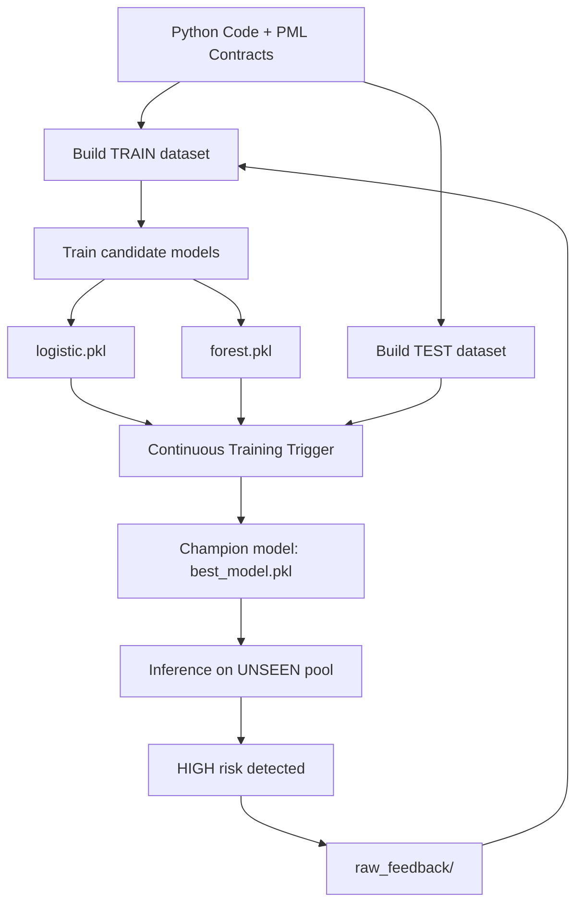

# SpecLens — System Specification Document (SSD)

## 1. Problem Definition

**SpecLens-PML** is an educational data-driven system that applies
Machine Learning and MLOps principles to the domain of software
correctness.

The project introduces **PML (Python Modelling Language)**, a
lightweight specification language inspired by JML (Java Modelling Language),
and builds an end-to-end **MLOps pipeline with feedback-driven retraining**

The system analyzes Python functions annotated with PML contracts:

- `@requires` (preconditions)  
- `@ensures` (postconditions)  
- `@invariant` (class invariants)

The ML task is formulated as a binary classification problem (SAFE vs RISKY).
Operational risk levels (LOW / MEDIUM / HIGH) are derived as a post-processing layer
on top of the model prediction to support governance decisions:

- Input: structural feature vector extracted from code + contracts  
- Output: probability of being RISKY and an operational risk level (`LOW`, `MEDIUM`, `HIGH`)

SpecLens-PML provides probabilistic decision support rather than formal correctness guarantees.

---

## 2. System Context and Stakeholders

Primary stakeholders include:

- Software engineers writing annotated Python code  
- QA and verification teams reviewing correctness risks  
- Developers experimenting with specification-driven MLOps automation  

The system operates between traditional testing and full formal verification:

- Like testing, it relies on **dynamic execution**  
- Like specification-based approaches, it treats contracts as semantic signals  

---

## 3. Key Performance Indicators (KPIs)

SpecLens-PML is evaluated through a set of safety-oriented and operational KPIs:

- Recall on the RISKY class (used as the main governance metric to ensure that high-risk specification violations are detected)
- Accuracy and F1-score on a held-out TEST dataset (measuring overall classification quality and generalization beyond the training pool)
- End-to-end latency for file analysis (< 2 seconds per file, ensuring that the system remains usable as an interactive decision-support tool)
- Stability of predictions across retraining cycles (preventing excessive behavioral shifts when feedback examples are reinjected)

Given the safety-oriented domain, SpecLens prioritizes interpretable models (logistic regression, random forest) and a decision-support framing rather than opaque black-box predictions.

---

## 4. Data Specification

The repository contains four pools of annotated Python examples:

- `raw_train/` — training pool  
- `raw_test/` — held-out evaluation pool  
- `raw_unseen/` — inference-only pool  
- `raw_feedback/` — collected high-risk examples  

Generated datasets:

- `datasets_train.csv`  
- `datasets_test.csv`  

These datasets are automatically produced during execution and are not tracked as static repository artifacts.

---

## 5. Label Generation

Labels are produced through **dynamic execution and contract checking**:

- Functions are executed on generated inputs  
- Pre/postconditions are validated  
- Violations or runtime failures (RISKY) 
- Otherwise (SAFE)

---

## 6. Feature Extraction

Feature extraction is centralized in `pipeline/features.py` and shared across training and inference.

Features include:

- Number of parameters  
- Number of contracts (`requires`, `ensures`, `invariant`)  
- Lines of code  
- Additional structural indicators  

---

## 7. Requirements

Functional Requirements:

| ID | Requirement | Acceptance Criteria |
|----|------------|---------------------|
| FR-01 | Parse PML contracts from Python code | Units parsed without errors |
| FR-02 | Extract structural features | Feature vector matches schema |
| FR-03 | Build TRAIN / TEST datasets automatically | CSV datasets generated |
| FR-04 | Train candidate models | Candidate artifacts saved |
| FR-05 | Evaluate candidates on TEST set | Metrics report produced |
| FR-06 | Promote champion model | `best_model.pkl` updated |
| FR-07 | Serve inference predictions | Risk level returned |
| FR-08 | Collect feedback from unseen inference | High-risk cases stored |

Non-Functional Requirements:

| ID | Requirement | Metric |
|----|------------|--------|
| NFR-01 | Performance | < 2s per file analysis |
| NFR-02 | Data separation | TRAIN never mixed with TEST |
| NFR-03 | Configurability | Policies controlled via YAML |
| NFR-04 | Maintainability | Modular pipeline structure |
| NFR-05 | Reproducibility | Resettable via `reset.sh` |

---

## 8. Architecture Overview

The following diagram summarizes the end-to-end SpecLens-PML architecture, from dataset generation and candidate training to governance-based promotion, inference and feedback-driven continuous retraining:

---

## 9. Risk Analysis

The table below summarizes four key technical and operational risks in SpecLens-PML: distribution shifts in coding and specification patterns (drift), imbalance between SAFE and RISKY examples, potential overfitting due to limited training data and the need to interpret probabilistic predictions as decision support rather than absolute guarantees, together with the corresponding mitigation strategies adopted in the pipeline:

| Risk | Impact | Mitigation |
|------|--------|------------|
| Drift in coding / spec patterns | Medium | Feedback-driven retraining |
| Class imbalance | Medium | Recall-oriented promotion |
| Overfitting on small datasets | Low | Held-out TEST evaluation |
| Misinterpretation of probabilistic outputs | Medium | Decision-support framing |

