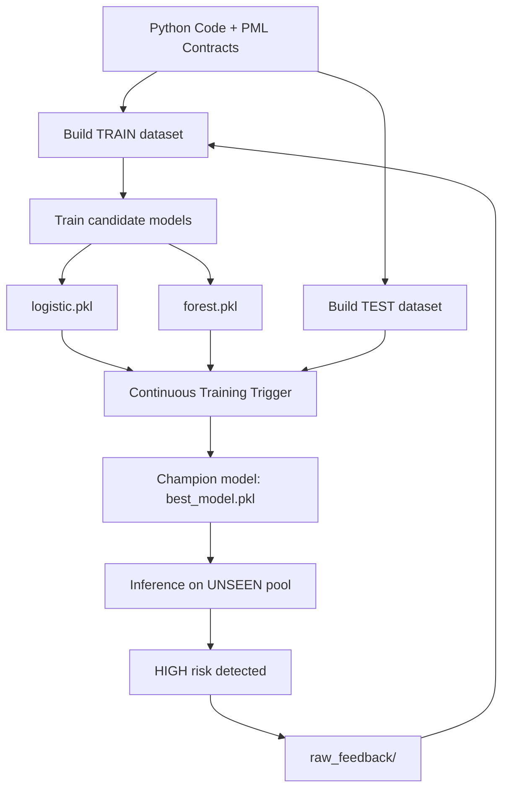

# SpecLens — System Specification Document (SSD)

## 1. Problem Definition

SpecLens-PML is an educational data-driven system applying Machine Learning and MLOps principles to the domain of **software correctness**.

The project introduces **PML (Python Modelling Language)**, a lightweight specification language inspired by JML, and provides an end-to-end pipeline with feedback-driven retraining.

The system analyzes Python functions annotated with PML contracts:

- `@requires` (preconditions)  
- `@ensures` (postconditions)  
- `@invariant` (class invariants)

The ML task is formulated as a **binary classification problem**:

- **Input:** structural feature vector extracted from code + contracts  
- **Output:** probability of being risky and an operational risk level (`LOW`, `MEDIUM`, `HIGH`)

SpecLens-PML provides probabilistic decision support rather than formal correctness guarantees.

---

## 2. System Context and Stakeholders

Primary stakeholders include:

- Software engineers writing annotated Python code  
- QA and verification teams reviewing correctness risks  
- Developers experimenting with specification-driven MLOps automation  

The system operates between traditional testing and full formal verification:

- Like testing, it relies on **dynamic execution**  
- Like specification-based approaches, it treats contracts as semantic signals  

---

## 3. Key Performance Indicators (KPIs)

The main evaluation metrics are:

- **Recall on the RISKY class** (safety-oriented promotion metric)  
- Accuracy and F1-score on a held-out TEST dataset  
- End-to-end latency for file analysis (< 2 seconds per file)  
- Stability of predictions across retraining cycles  

- Given the safety-oriented domain, SpecLens prioritizes interpretable models (logistic regression, random forest) and a decision-support framing rather than opaque black-box predictions.

---

## 4. Data Specification

### 4.1 Data Sources and Pools

The repository contains four pools of annotated Python examples:

- `raw_train/` — training pool  
- `raw_test/` — held-out evaluation pool  
- `raw_unseen/` — inference-only pool  
- `raw_feedback/` — collected high-risk examples  

Generated datasets:

- `datasets_train.csv`  
- `datasets_test.csv`  

These datasets are automatically produced during execution and are not tracked as static repository artifacts.

---

### 4.2 Label Generation

Labels are produced through **dynamic execution and contract checking**:

- functions are executed on generated inputs  
- pre/postconditions are validated  
- violations or runtime failures → **RISKY**  
- otherwise → **SAFE**

---

### 4.3 Feature Extraction

Feature extraction is centralized in `pipeline/features.py` and shared across training and inference.

Features include:

- number of parameters  
- number of contracts (`requires`, `ensures`, `invariant`)  
- lines of code  
- additional structural indicators  

---

## 5. Requirements

### Functional Requirements

| ID | Requirement | Acceptance Criteria |
|----|------------|---------------------|
| FR-01 | Parse PML contracts from Python code | Units parsed without errors |
| FR-02 | Extract structural features | Feature vector matches schema |
| FR-03 | Build TRAIN/TEST datasets automatically | CSV datasets generated |
| FR-04 | Train candidate models | Candidate artifacts saved |
| FR-05 | Evaluate candidates on TEST set | Metrics report produced |
| FR-06 | Promote champion model | `best_model.pkl` updated |
| FR-07 | Serve inference predictions | Risk level returned |
| FR-08 | Collect feedback from unseen inference | High-risk cases stored |

---

### Non-Functional Requirements

| ID | Requirement | Metric |
|----|------------|--------|
| NFR-01 | Performance | < 2s per file analysis |
| NFR-02 | Data separation | TRAIN never mixed with TEST |
| NFR-03 | Configurability | Policies controlled via YAML |
| NFR-04 | Maintainability | Modular pipeline structure |
| NFR-05 | Reproducibility | Resettable via `reset.sh` |

---

## 6. Architecture Overview

---

## 7. Risk Analysis

| Risk | Impact | Mitigation |
|------|--------|------------|
| Drift in coding/spec patterns | Medium | Feedback-driven retraining |
| Class imbalance | Medium | Recall-oriented promotion |
| Overfitting on small datasets | Low | Held-out TEST evaluation |
| Misinterpretation of probabilistic outputs | Medium | Decision-support framing |

