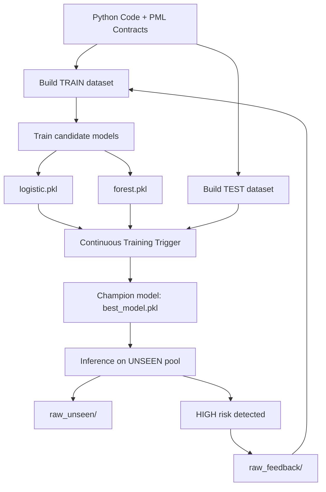

# SpecLens — System Specification Document (SSD)

## 1. Problem Definition

SpecLens-PML is an educational data-driven system that applies Machine Learning
and MLOps principles to the domain of software correctness.

The project introduces PML (Python Modelling Language), a lightweight
specification language inspired by JML (Java Modelling Language) and by Python
contract libraries such as `icontract`.

The system analyzes Python functions annotated with PML contracts:

- `@requires`: precondition
- `@ensures`: postcondition
- `@invariant`: class invariant
- `old(...)`: lightweight pre-state reference
- `@snapshot <name> = <expr>`: named pre-state snapshot

The ML task is formulated as a binary classification problem (`SAFE / RISKY`).
Operational risk levels (`LOW / MEDIUM / HIGH`) are derived as a
post-processing layer on top of the model prediction to support governance
decisions.

- Input: structural and contract-aware feature vector extracted from code and contracts
- Output: probability of being RISKY and an operational risk level

SpecLens-PML provides probabilistic decision support rather than formal
correctness guarantees.

---

## 2. System Context and Stakeholders

The system operates between traditional testing and full formal verification:

- Like testing, it relies on dynamic execution
- Like specification-based approaches, it treats contracts as semantic signals
- Like lightweight MLOps systems, it includes feedback-driven retraining and model promotion

Primary stakeholders include:

- Software engineers writing annotated Python code
- Quality Assurance (QA) and verification teams reviewing correctness risks
- Developers experimenting with specification-driven MLOps automation
- Researchers studying explainable and controllable risk assessment for software artifacts

---

## 3. Key Performance Indicators (KPIs)

The SpecLens-PML prototype focuses on safety-oriented and operational KPIs:

- Candidate models are compared on the held-out TEST set
- The model achieving the highest recall on the RISKY class, above a minimum threshold in `config.yaml`, is promoted as the serving champion
- Interactive inference remains fast on single files
- Training and retraining costs scale with dataset growth
- Generated feature schemas remain consistent between training, promotion, and inference
- Tree-based candidate models export DPG-ready training context for future explanation experiments

Given the safety-oriented domain, SpecLens-PML prioritizes interpretable and
inspectable models, such as logistic regression and random forest, and provides a
decision-support advisory rather than black-box correctness guarantees.

---

## 4. Data Specification

The repository contains four pools of annotated Python examples:

- `raw_train/`: training pool
- `raw_test/`: held-out evaluation pool
- `raw_unseen/`: inference-only pool
- `raw_feedback/`: collected high-risk examples

Generated datasets are stored under:

- `data/processed/datasets_train.csv`
- `data/processed/datasets_test.csv`

During dataset generation, code is parsed, contracts are extracted, and
structural and contract-aware features are normalized into a consistent tabular
schema shared across training and inference.

Generated datasets are automatically produced during execution and should not be
treated as static source artifacts.

Some examples are adapted from the Python-by-Contract corpus, which uses
`icontract` annotations. These examples are normalized into the lightweight PML
syntax supported by SpecLens-PML.

---

## 5. Label Generation

Labels are produced through dynamic execution and contract checking:

- Functions are executed on generated inputs
- Preconditions (`@requires`) are checked before execution
- Named snapshots (`@snapshot`) and `old(...)` pre-state values are captured before execution
- Postconditions (`@ensures`) are checked after execution
- Class invariants (`@invariant`) are checked where applicable
- Runtime contract violations are labeled as `RISKY`
- Otherwise, the function is labeled as `SAFE`

During inference, the predicted RISKY probability is mapped into operational
levels:

- `LOW`
- `MEDIUM`
- `HIGH`

---

## 6. Feature Extraction

Feature extraction is centralized in `pipeline/features.py` and shared across
training, promotion, and inference.

Features include:

- Number of function parameters
- Number of contracts:
  - `requires`
  - `ensures`
  - invariants
  - total contracts
- Contract-complexity features
- Pre-state and snapshot features:
  - `n_old_refs`
  - `ensures_has_old`
  - `invariants_has_old`
  - `n_snapshots`
  - `has_snapshot`
  - `snapshot_complexity`
  - `ensures_uses_snapshot`
  - `has_prestate_reference`
- Structural AST features:
  - lines of code
  - number of branches
  - number of loops
  - number of returns
  - subscript usage
  - division usage
  - mutation usage
  - method-call usage
- State-related indicators:
  - `has_self`
  - `has_stateful_contract`

The generated CSV files also include metadata columns:

- `file`
- `function`
- `label`

Training and inference select only numeric feature columns for model fitting and
prediction.

---

## 7. Requirements

### Functional Requirements

| ID | Requirement | Acceptance Criteria |
|----|------------|---------------------|
| FR-01 | Parse PML contracts from Python code | Units parsed without errors |
| FR-02 | Parse `old(...)` and `@snapshot` constructs | Pre-state references extracted and evaluated |
| FR-03 | Extract structural and contract-aware features | Feature vector matches schema |
| FR-04 | Build TRAIN / TEST datasets automatically | CSV datasets generated under `data/processed/` |
| FR-05 | Train candidate models | Candidate artifacts saved |
| FR-06 | Evaluate candidates on TEST set | Metrics report produced |
| FR-07 | Promote champion model | `best_model.pkl` updated |
| FR-08 | Serve inference predictions | Risk level returned |
| FR-09 | Collect feedback from unseen inference | High-risk cases stored |
| FR-10 | Export DPG-ready model context | Feature names, training features, and labels saved |

### Non-Functional Requirements

| ID | Requirement | Metric |
|----|------------|--------|
| NFR-01 | Performance | Inference latency low for individual files, while training time naturally scales with dataset size |
| NFR-02 | Data separation | TRAIN never mixed with TEST |
| NFR-03 | Configurability | Policies controlled via YAML |
| NFR-04 | Maintainability | Modular pipeline structure |
| NFR-05 | Reproducibility | Resettable via `reset.sh` |
| NFR-06 | Traceability | Raw pools, generated datasets, and model artifacts have distinct locations |
| NFR-07 | Explainability readiness | Tree-based models expose DPG-ready context |

---

## 8. Architecture Overview

The full pipeline can be executed reproducibly from scratch using the provided
`reset.sh` script, which clears generated artifacts and resets the feedback loop
before a new run.

The following diagram represents the implemented operational lifecycle,
including the feedback loop that reinjects high-risk unseen examples into
training on subsequent runs:

```mermaid
flowchart TD

    A[Python Code + PML Contracts] --> B1[Build TRAIN dataset]
    A --> B2[Build TEST dataset]

    B1 --> D[Train candidate models]
    D --> E1[logistic.pkl]
    D --> E2[forest.pkl]

    E1 --> F[Continuous Training Trigger]
    E2 --> F
    B2 --> F

    F --> G[Champion model: best_model.pkl]

    G --> H[Inference on UNSEEN pool]
    H --> I[raw_unseen/]

    H --> J[HIGH risk detected]
    J --> K[raw_feedback/]

    K --> B1
```

This diagram represents the full implemented workflow: feedback examples are
collected and re-injected into TRAIN at the next run.

The promoted champion (`best_model.pkl`) is the single deployed serving artifact,
used both in CLI inference (`predict.py`) and in the Streamlit interface
(`app.py`).

Lightweight monitoring is achieved through governance signals such as recall
drops or HIGH-risk surges, triggering feedback collection and retraining.

---

## 9. Risk Analysis

The table below summarizes key technical and operational risks in SpecLens-PML,
together with corresponding mitigation strategies adopted in the pipeline:

| Risk | Impact | Mitigation |
|------|--------|------------|
| Drift in coding / spec patterns | Medium | Feedback-driven retraining |
| Class imbalance | Medium | Recall-oriented promotion |
| Overfitting on small datasets | Medium | Held-out TEST evaluation |
| Misinterpretation of probabilistic outputs | Medium | Decision-support advisory |
| Unsupported Python or contract semantics | Medium | Lightweight scope and compatibility filtering |
| Generated artifacts accidentally committed | Low | `.gitignore` and resettable runtime outputs |
| Explanation overclaiming | Medium | DPG used as structural support, not as formal proof |

---

## 10. Explainability and DPG Readiness

SpecLens-PML currently produces risk predictions through trained candidate
models. The latest feature schema and training context export are designed to
support future Decision Predicate Graph (DPG) experiments.

The Random Forest candidate is the natural model for DPG-based analysis because
DPG operates on tree-based decision structures.

The exported context includes:

- feature names
- training feature matrix
- training labels

This enables future analysis of:

- global structural explanations
- local explanation paths
- class-specific central predicates
- mapping of decision predicates to software-engineering concepts
- effects of policy or threshold changes on decision structure

DPG is intended as an explainability and governability support layer, not as a
replacement for the existing prediction pipeline.
